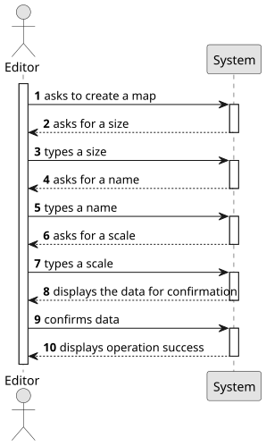

# US001 - Create a Map

## 1. Requirements Engineering

### 1.1. User Story Description

As an Editor, I want to create a map with a size and a name.

### 1.2. Customer Specifications and Clarifications 
**From the specifications document:**

> As a user with the Editor role, I should be able to create a map, which needs to include a name and a size. For the size, there is an imposed, lower and upper limit which it may obey in its dimensions. As for the name, it is free of choice, however the language should be appropriate.

**From the client clarifications:**

> **Question**: "Can a scenario have the same name as a map?"
>
> **Answer**: "Yes, as they are different objects."

> **Question**: "Do the maps created only cover countries or can they be extended to entire continents?
For example, an entire map of Europe."
> 
> **Answer**: "There are no restrictions on the geographical areas represented."

> **Question**: "What are the minimum and maximum dimensions allowed for a map (e.g., width and height in units or pixels)?"
> 
> **Answer**: "Should be positive integer."

> **Question**: "Is there a predefined list of sizes, or should users be able to input custom dimensions?"
>
> **Answer**: "Custom dimensions but suggesting predefined sizes could be a good idea."

> **Question**: "Are there any requirements or restrictions for the map's name (e.g., character limit, allowed/disallowed characters)?"
> 
> **Answer**: "File name like restrictions."

> **Question**: "Should map names be unique within the system?"
> 
> **Answer**: "Yes."

### 1.3. Acceptance Criteria

* AC01: The map's dimensions are positive integers
* AC02: Map name should be a valid file name
* AC03: The maps should have a scale that states the size of cell map in
  kms.
* AC04: Map name should be unique

### 1.4. Found out Dependencies

There are no dependencies in this user story.

### 1.5 Input and Output Data

**Input Data:**

* Typed data:
    * the request
    * a size
    * a name
    * a scale

* Selected data:

**Output Data:**

* Data for confirmation
* (In)Success of the operation

### 1.6. System Sequence Diagram (SSD)

**_Other alternatives might exist._**

### 1.7 Other Relevant Remarks

Nothing as of right now.
