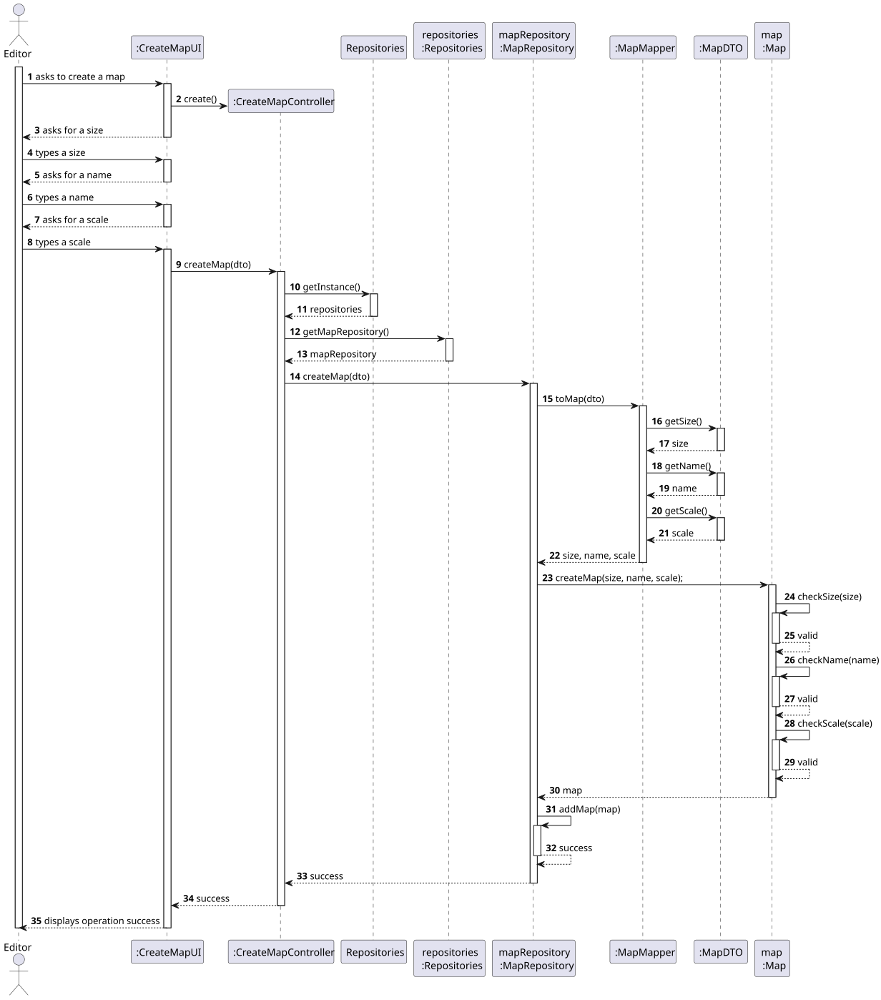
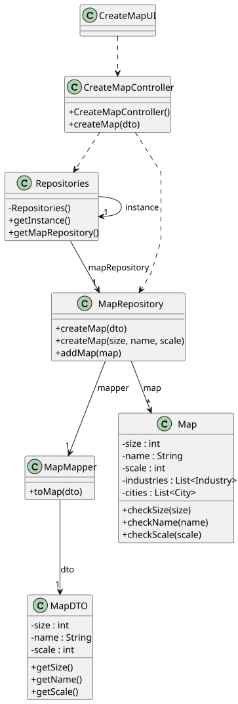

# US001 - Create a Map

## 3. Design

### 3.1. Rationale

| **Interaction ID** | **Question: Which class is responsible for...**                     | **Answer**                      | **Justification (with patterns)**                                                                   |
|--------------------|---------------------------------------------------------------------|---------------------------------|-----------------------------------------------------------------------------------------------------|
| 2                  | Handling the user’s request to create a map?                        | `:CreateMapController`          | **Controller** – Coordinates system operations, separates UI from logic.                            |
| 15                 | Extracting data from the DTO to create a domain object?             | `:MapMapper`                    | **Information Expert**, **Pure Fabrication** – Knows both DTO and domain; added to reduce coupling. |
| 16–22              | Providing access to size, name, and scale attributes?               | `:MapDTO`                       | **Information Expert** – Holds and provides its own data.                                           |
| 25–34              | Validating the size, name, and scale of the map?                    | `map : Map`                     | **Information Expert**, **Controller** – Owns and validates its data internally.                    |
| 24                 | Creating the `Map` object from raw parameters?                      | `mapRepository : MapRepository` | **Creator** – Aggregates maps; responsible for creating and storing them.                           |
| 1–14               | Interacting with the user to collect map input (size, name, scale)? | `:CreateMapUI`                  | **Low Coupling** – Delegates logic to the controller, interacts only with UI inputs.                |
| 15                 | Converting a `MapDTO` into a `Map` domain object?                   | `:MapMapper`                    | **High Cohesion**, **Pure Fabrication** – Dedicated to transformation logic.                        |

### Systematization ##

According to the taken rationale, the conceptual classes promoted to software classes are: 

* Map

Other software classes (i.e. Pure Fabrication) identified: 

* CreateMapUI
* CreateMapController
* MapDTO
* MapMapper
* Repositories
* MapRepository

## 3.2. Sequence Diagram (SD)

### Full Diagram

This diagram shows the full sequence of interactions between the classes involved in the realization of this user story.

## 3.3. Class Diagram (CD)

