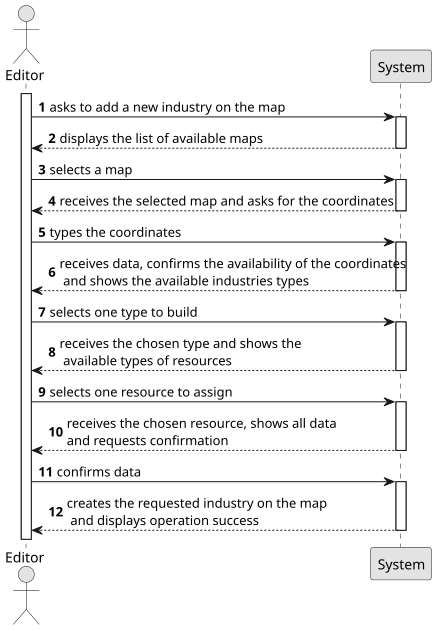

# US002 - Place an Industry

## 1. Requirements Engineering

### 1.1. User Story Description

As an Editor, I want to add an industry (selected from the
available industries) in a position XY of the selected (current) map.

### 1.2. Customer Specifications and Clarifications 

**From the specifications document:**

> As a user with the Editor role, I should be able to create an industry in a certain map, with user given coordinates and type.
  To do so, coordinates need to be declared by the user and then the type of industry needs to be selected, chosen from the available ones.

**From the client clarifications:**

> **Question**: "When adding a new industry to a map, is there any other necessary input aside from position and industry type?"
>
> **Answer**: "No."

> **Question**: "Is it possible to select more than one industry at the same time to be placed on the map?"
> 
>  **Answer**: "This is more a question of UX/UI than of how the US itself works, so the teams are free to decide."

### 1.3. Acceptance Criteria

* There is no acceptance criteria in this US.

### 1.4. Found out Dependencies

* There is a dependency on US001, as it needs a map to be available for the industry to be placed on.

### 1.5 Input and Output Data

**Input Data:**

* Typed data:
    * the request
    * a XY position
	
* Selected data:
    * a map 
    * an industry type

**Output Data:**

* List of available maps
* List of available industry types
* Data for confirmation
* (In)Success of the operation

### 1.6. System Sequence Diagram (SSD)

**_Other alternatives might exist._**

### 1.7 Other Relevant Remarks

* None