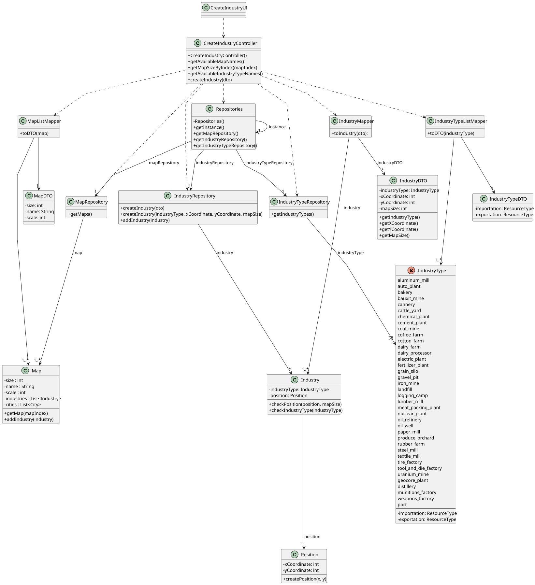

# US002 - Place an Industry

## 3. Design

### 3.1. Rationale

| **Interaction ID**  | **Question: Which class is responsible for...**                             | **Answer**                                                  | **Justification (with patterns)**                                                            |
|---------------------|-----------------------------------------------------------------------------|-------------------------------------------------------------|----------------------------------------------------------------------------------------------|
| 1–7                 | Handling user interactions for adding an industry                           | `:CreateIndustryUI`                                         | **Controller** – Manages UI interactions and delegates business logic to controller.         |
| 8–38                | Coordinating industry creation workflow, including fetching data and saving | `:CreateIndustryController`                                 | **Controller** – Orchestrates use case, interacts with repositories and mappers.             |
| 9, 14, 26, 39–44    | Providing access to repositories singleton                                  | `Repositories`                                              | **Pure Fabrication** – Centralized singleton providing repository access to reduce coupling. |
| 10, 16, 28, 40      | Managing and storing Map domain objects                                     | `mapRepository : MapRepository`                             | **Creator** – Responsible for creating and managing map domain objects.                      |
| 17, 29, 41          | Managing IndustryType domain objects                                        | `industryTypeRepository : IndustryTypeRepository`           | **Creator** – Creates and manages IndustryType domain objects.                               |
| 19, 31, 43          | Managing Industry domain objects                                            | `industryRepository : IndustryRepository`                   | **Creator** – Responsible for creating and storing Industry objects.                         |
| 11–21, 30–33, 42–45 | Mapping between DTOs and domain objects                                     | `MapListMapper`, `IndustryTypeListMapper`, `IndustryMapper` | **Pure Fabrication**, **Information Expert** – Handles conversion to reduce coupling.        |
| 34–38               | Validating industry position and type                                       | `industry : Industry`                                       | **Information Expert** – Holds business logic related to Industry validity.                  |
| 35                  | Creating Position objects                                                   | `position : Position`                                       | **Information Expert** – Knows position data and creation logic.                             |
| 12, 22, 32          | Holding and providing data for MapDTO, IndustryTypeDTO, IndustryDTO         | `MapDTO`, `IndustryTypeDTO`, `IndustryDTO`                  | **Information Expert** – Owns the data it represents.                                        |

### Systematization ##

According to the taken rationale, the conceptual classes promoted to software classes are: 

* Map
* IndustryType
* Industry
* Position

Other software classes (i.e. Pure Fabrication) identified: 

* CreateIndustryUI
* CreateIndustryController
* Repositories
* MapRepository
* IndustryTypeRepository
* IndustryRepository
* MapListMapper
* IndustryTypeListMapper
* IndustryMapper
* MapDTO
* IndustryTypeDTO
* IndustryDTO

## 3.2. Sequence Diagram (SD)

### Full Diagram

This diagram shows the full sequence of interactions between the classes involved in the realization of this user story.

## 3.3. Class Diagram (CD)

