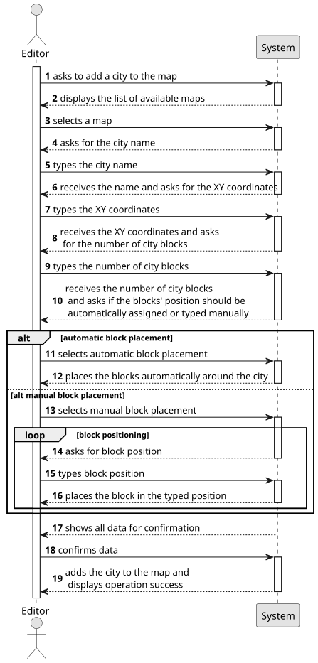

# US003 - Add a City
## 1. Requirements Engineering

### 1.1. User Story Description

As an Editor, I want to add a city in a position XY of the selected map, with a name and a positive number of house blocks.

### 1.2. Customer Specifications and Clarifications 

**From the specifications document:**

>An Editor wants to change the map adding a city. To do this, the Editor must add all the city information (name, position and number of blocks). The data must follow some rules like: the cty cannot have special characters and digits; the house blocks can be assigned manually or automatically. 

**From the client clarifications:**

> **Question**: "Is it possible for a city to be destroyed by a natural disaster or a war? If so, is it necessary to create a mechanism to remove the city from the map and create a new one to transfer the active elements from the first one(people, mail, ...)?"
> 
> **Answer**: "A city can be removed in edit mode, but not in simulation mode."

> **Question**: "Is there a minimum or maximum number of house blocks that can be assigned?"
>
> **Answer**: "The number needs to be a positive on; there is no maximum, it's up to the editor to decide."

> **Question**: "According to User Story 3, can the name of the city have spaces in its nomenclature?"
> 
> **Answer**: "Yes you can, “Torres Novas” for example."

> **Question**: "According to User Story 3, the name of the city must be unique within the same map?"
> 
> **Answer**: "It can be repeated but can become confusing for Players, the Editor should be alerted to the situation."

### 1.3. Acceptance Criteria

* **AC1:** A city name cannot have special characters or digits.
* **AC2:** The house blocks can be assigned manually or automatically (randomly around the city tag position accordingly to normal distribution)
* **AC3:** The number of house blocks needs to be a positive integer with no maximum limit
* **AC4:** A city name should not be repeated to avoid Player's confusion

### 1.4. Found out Dependencies

* There is a dependency on US001 as there must be a map already created.

### 1.5 Input and Output Data

**Input Data:**

* Typed data:
    * the request 
    * a city name
    * XY city coordinates
    * a positive number of blocks
    * XY block coordinates
  
* Selected data:
  * a map
  * choice of block placement
  * blocks' position option

**Output Data:**

* List of available maps
* Blocks' position option 
* Data for confirmation
* (In)Success of the operation

### 1.6. System Sequence Diagram (SSD)

**_Other alternatives might exist._**

### 1.7 Other Relevant Remarks

* Nothing to say.  