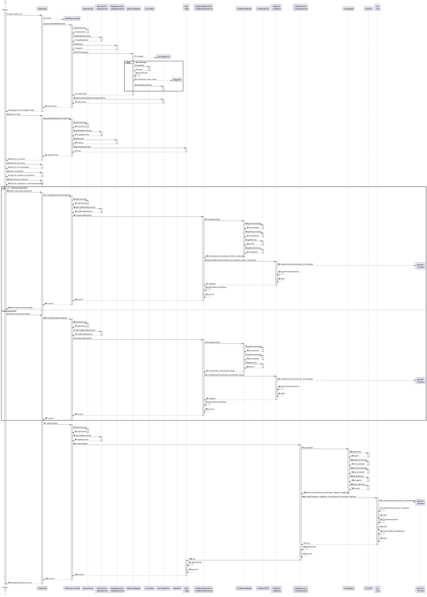
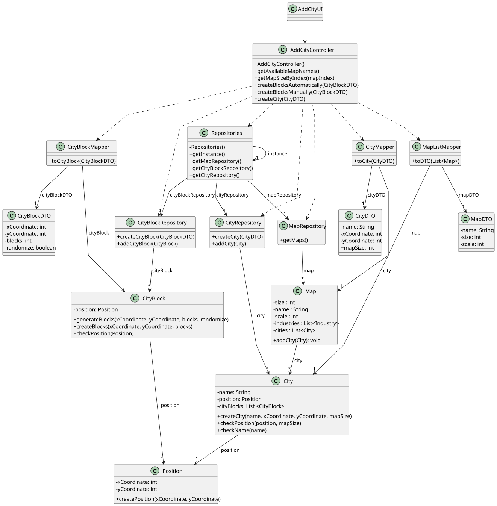

# US003 - Add a City

## 3. Design

### 3.1. Rationale

| **Interaction ID**             | **Question: Which class is responsible for...**                            | **Answer**                                          | **Justification (with patterns)**                                                                       |
|--------------------------------|----------------------------------------------------------------------------|-----------------------------------------------------|---------------------------------------------------------------------------------------------------------|
| 1–7                            | Handling user interactions for adding a city                               | `:AddCityUI`                                        | **Controller** – Manages UI input and output, delegates business logic.                                 |
| 8–56                           | Coordinating the add city workflow, including block creation & city saving | `:AddCityController`                                | **Controller** – Orchestrates the use case, repository access, and mapper invocations.                  |
| 9, 15, 21, 24, 31, 36, 43, 50  | Providing access to repositories singleton                                 | `Repositories`                                      | **Pure Fabrication** – Central singleton to access domain repositories, reduces coupling.               |
| 10, 16, 22, 25, 32, 37, 44, 51 | Managing and storing Map domain objects                                    | `mapRepository : MapRepository`                     | **Creator** – Responsible for creating and managing map domain objects.                                 |
| 17, 38, 45, 52                 | Managing and storing CityBlock domain objects                              | `cityBlockRepository : CityBlockRepository`         | **Creator** – Responsible for creating and managing city blocks.                                        |
| 18, 39, 46, 53                 | Managing and storing City domain objects                                   | `cityRepository : CityRepository`                   | **Creator** – Responsible for creating and managing City domain objects.                                |
| 11, 27, 33, 40, 47, 54         | Mapping between DTOs and domain objects                                    | `MapListMapper`, `CityBlockMapper`, `CityMapper`    | **Pure Fabrication** – Converts between DTO and domain objects, encapsulating mapping logic.            |
| 12, 34, 41, 48                 | Holding and providing data for DTOs (MapDTO, CityBlockDTO, CityDTO)        | `MapDTO`, `CityBlockDTO`, `CityDTO`                 | **Information Expert** – Owns and provides access to data it represents.                                |
| 19–23, 35–42, 49–55            | Validating domain data, checking positions, and adding entities            | `cityBlock : CityBlock`, `city : City`, `map : Map` | **Information Expert** – Encapsulates domain logic for validity, position checks, and state management. |

### Systematization ##

According to the taken rationale, the conceptual classes promoted to software classes are: 

* Map
* City
* CityBlock
* Position

Other software classes (i.e. Pure Fabrication) identified: 

* AddCityUI
* AddCityController
* Repositories
* MapRepository
* CityBlockRepository
* CityRepository
* MapListMapper
* MapDTO
* CityBlockMapper
* CityBlockDTO
* CityMapper
* CityDTO

## 3.2. Sequence Diagram (SD)

### Full Diagram

This diagram shows the full sequence of interactions between the classes involved in the realization of this user story.

## 3.3. Class Diagram (CD)

