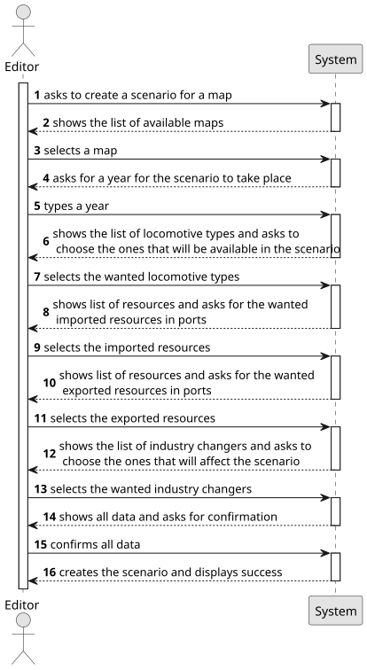

# US004 - Create a scenario

## 1. Requirements Engineering

### 1.1. User Story Description

As an Editor, I want to create a scenario for a selected map.

### 1.2. Customer Specifications and Clarifications 

**From the specifications document:**

> As a user with the Editor role, I should be able to create a scenario for a certain map. Within the scenario creation, a name should be given. There are also restrictions integrated in this scenario, such as time, technological and historical ones.

**From the client clarifications:** 

### 1.3. Acceptance Criteria
* AC1: Definition of the port's behavior, which cargoes they import/export and/or transform;
* AC2: Definition of the available locomotion types (steam, diesel, and/or electric).
* AC3: (Re)Definition of the factors that alter the generation (frequency) of generating industries

### 1.4. Found out Dependencies

* There is a dependency on US001 since a scenario must be associated with an existing map.

### 1.5 Input and Output Data

**Input Data:**

* Typed data:
    * the request
    * a year
	
* Selected data:
    * a map
    * the available locomotive types
    * the imported resources
    * the exported resources
    * an industry changer

**Output Data:**

* List of available maps
* List of locomotive types
* List of resource types
* List of industry changers
* Data for confirmation
* (In) Success of the operation

### 1.6. System Sequence Diagram (SSD)

**_Other alternatives might exist._**

### 1.7 Other Relevant Remarks
