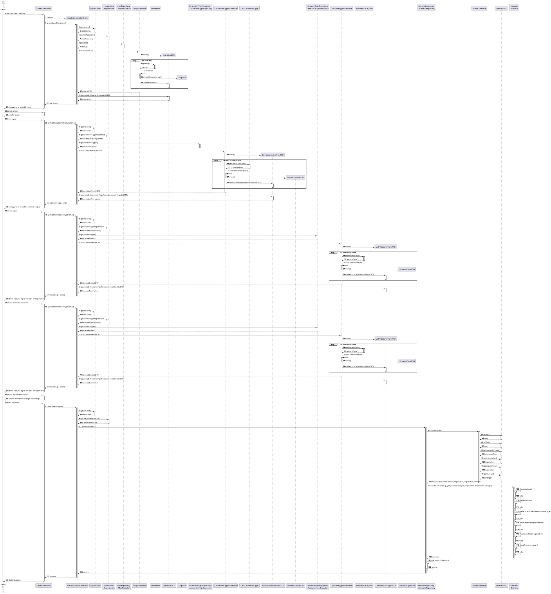
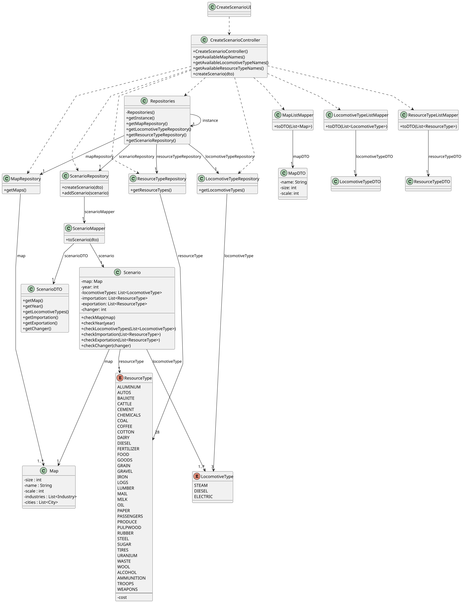

# US004 - Create a scenario

## 3. Design

### 3.1. Rationale

| **Interaction ID**         | **Question: Which class is responsible for...**                                                     | **Answer**                                                             | **Justification (with patterns)**                                                                                                                                                                |
|----------------------------|-----------------------------------------------------------------------------------------------------|------------------------------------------------------------------------|--------------------------------------------------------------------------------------------------------------------------------------------------------------------------------------------------|
| 1–6                        | Handling user input and initial UI interaction to start scenario creation                           | `:CreateScenarioUI`                                                    | **Controller (UI Layer)** – Manages interactions with the Editor actor, gathers user input, displays available options.                                                                          |
| 7–43                       | Coordinating scenario creation workflow, including retrieving repositories and mapping data         | `:CreateScenarioController`                                            | **Controller** – Orchestrates calls to repositories, mappers, and domain objects, enforcing application logic.                                                                                   |
| 8, 14, 20, 26              | Providing singleton access to all repositories                                                      | `Repositories`                                                         | **Pure Fabrication (Singleton)** – Central access point for all repositories, reducing coupling and simplifying access.                                                                          |
| 9, 15, 21, 27              | Providing access to the Map repository                                                              | `mapRepository : MapRepository`                                        | **Creator** – Manages retrieval and persistence of Map domain objects.                                                                                                                           |
| 10, 16, 22, 28             | Providing access to the LocomotiveType repository                                                   | `locomotiveTypeRepository : LocomotiveTypeRepository`                  | **Creator** – Manages locomotive type domain objects lifecycle.                                                                                                                                  |
| 11, 17, 23, 29             | Providing access to the ResourceType repository                                                     | `resourceTypeRepository : ResourceTypeRepository`                      | **Creator** – Manages resource type domain objects lifecycle.                                                                                                                                    |
| 12–13, 18–19, 24–25, 30–31 | Mapping domain objects to DTOs and vice versa                                                       | `MapListMapper`, `LocomotiveTypeListMapper`, `ResourceTypeListMapper`  | **Pure Fabrication** – Converts domain models to DTOs for UI use and vice versa, encapsulating mapping logic.                                                                                    |
| 14, 20, 26, 32             | Holding and managing collections of DTOs                                                            | `List<MapDTO>`, `List<LocomotiveTypeDTO>`, `List<ResourceTypeDTO>`     | **Information Expert** – Stores DTO collections and provides data to controller/UI.                                                                                                              |
| 33–59                      | Creating the Scenario domain object, validating input, and persisting                               | `scenarioRepository : ScenarioRepository`, `scenario : Scenario`       | **Creator** (ScenarioRepository) – Responsible for creating and saving scenarios. **Information Expert** (Scenario) – Validates all scenario data and ensures consistency before persistence. |
| 35–57                      | Validating scenario attributes (map, year, locomotive types, import/export resource types, changer) | `scenario : Scenario`                                                  | **Information Expert** – Encapsulates domain rules and validation logic for scenario creation.                                                                                                   |
| 58–60                      | Providing final success/failure response to UI                                                      | `scenarioRepository : ScenarioRepository`, `:CreateScenarioController` | **Controller** & **Creator** – Repository confirms persistence success, controller informs UI.                                                                                                   |

### Systematization ##

According to the taken rationale, the conceptual classes promoted to software classes are: 

* Scenario
* Map
* LocomotiveType
* ResourceType 

Other software classes (i.e. Pure Fabrication) identified: 

* CreateScenarioUI
* CreateScenarioController
* Repositories
* MapRepository
* LocomotiveTypeRepository
* IndustryTypeRepository
* IndustryChangerRepository
* ScenarioRepository
* MapListMapper
* LocomotiveTypeListMapper
* ResourceTypeListMapper
* ScenarioMapper
* MapDTO
* LocomotiveTypeDTO
* ResourceTypeDTO
* ScenarioDTO
 

## 3.2. Sequence Diagram (SD)

### Full Diagram

This diagram shows the full sequence of interactions between the classes involved in the realization of this user story.

### Split Diagrams

The following diagram shows the same sequence of interactions between the classes involved in the realization of this user story, but it is split in partial diagrams to better illustrate the interactions between the classes.

It uses Interaction Occurrence (a.k.a. Interaction Use).

**Get Task Category List Partial SD**

**Get Task Category Object**

**Get Employee**

**Create Task**

## 3.3. Class Diagram (CD)

