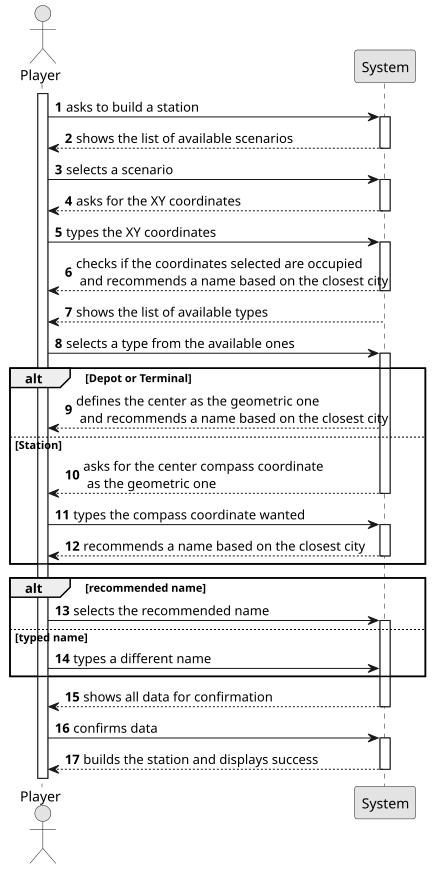

# US005 - Build a station 

## 1. Requirements Engineering

### 1.1. User Story Description

As a Player, I want to build a station (can be a depot, a station
or a terminal) with a location in the current map. The system should
propose a name for the station based on the closest city and the station
(e.g., Porto Terminal, Ovar Station or Silvalde Depot). In the case of Depot
and Terminal, the center is the geometric one, in the case of Station,
the center should be defined by the Player (NE, SE, NW, SW).

### 1.2. Customer Specifications and Clarifications 

**From the specifications document:**

> As a user with the Player role, I should be able to create a new station, choosing from the available types (depot, station or terminal), on the map. However, it must be checked whether the chosen location is occupied with other building, avoiding Overbuilding. An appropriate name should be given by the system, depending on where the station is built. Finally, on one hand, if the type chosen is a Depot or a Terminal, its centre should be the geometric one. On the other hand, if the type chosen is Station, the centre is determined by the Player, using compass coordinates (North, South, East, West).

**From the client clarifications:**

> **Question** : "Is the budget the only concern to build a station, or does the player also needs to have other specific resources, like steel, etc.? Are resources included on the budget, or the budget represent only the player's monetary value?"
> 
> **Answer**: "Just the budget in a generic currency."

> **Question**: "Can the Player buy stations? Or does the Editor create the stations, and they automatically become available to the Player?"
>
> **Answer**: "Yes, the Player buys stations and places them in the scenario during the simulation/game."

> **Question**: "If overbuilding occurs, the program stops running and the game ends or simply gives an error message and asks again for the station construction place?"
> 
> **Answer**: "
Overbuilding in the Editor is possible, the existing building is replaced for the new one. Overbuilding in the Simulator is NOT possible, the player gets a warning and games continues."

> **Question**: "Should users have options to select different station types (Depot, Station, Terminal) based on the game rules?"
> 
> **Answer**: "No, a player can build depots, stations and terminal as far as he has available budget and there is no overbuilding."

### 1.3. Acceptance Criteria

* **AC1:** Overbuilding is not possible.

### 1.4. Found out Dependencies

* There is a dependency on US001 as there needs to be a map already created, and on US002 and US003 as there can be a city or and industry already built in the wanted location.

### 1.5 Input and Output Data

**Input Data:**

* Typed data:
    * the request
    * XY coordinates
    * a name
    * a center

* Selected data:
  * a scenario 
  * a type

**Output Data:**

* List of available scenarios
* Recommended name
* List of available station types
* Data for confirmation
* (In)Success of the operation

### 1.6. System Sequence Diagram (SSD)

**_Other alternatives might exist._**

### 1.7 Other Relevant Remarks

* None at the moment