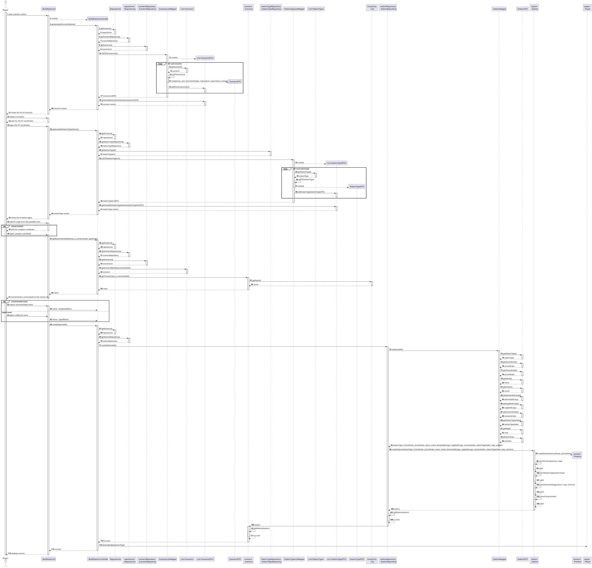
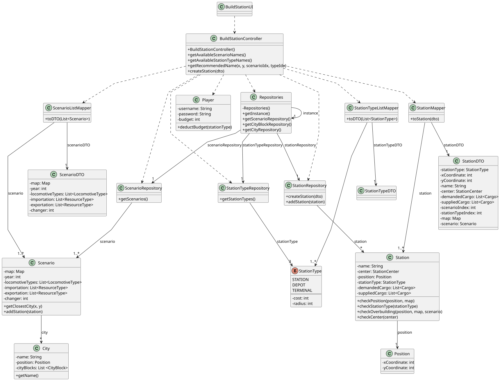

# US005 - Build a station

## 3. Design

### 3.1. Rationale

| **Interaction ID**    | **Question: Which class is responsible for...**                                           | **Answer**                                           | **Justification (with patterns)**                                                                                                      |
|-----------------------|-------------------------------------------------------------------------------------------|------------------------------------------------------|----------------------------------------------------------------------------------------------------------------------------------------|
| 1–4                   | Handling user input and initial UI interaction to start building a station                | `:BuildStationUI`                                    | **Controller** – Handles all interactions with the Player (UI Layer).                                                                  |
| 5–19                  | Coordinating scenario retrieval and providing scenario names to UI                        | `:BuildStationController`                            | **Controller** – Orchestrates use cases, coordinates between UI and repositories.                                                      |
| 7, 11, 15, 20, 25, 29 | Providing singleton access to repositories                                                | `Repositories`                                       | **Pure Fabrication (Singleton)** – Centralized repository access, reduces coupling.                                                    |
| 8, 12, 16, 21, 26, 30 | Managing Scenario data retrieval and persistence                                          | `scenarioRepository : ScenarioRepository`            | **Information Expert** – Knows how to retrieve and store Scenario domain objects.                                                      |
| 22–39                 | Mapping domain Scenarios to DTOs and vice versa                                           | `ScenarioListMapper`                                 | **Pure Fabrication** – Encapsulates mapping logic, avoiding domain/UI coupling.                                                        |
| 40–46                 | Holding and managing collections of ScenarioDTOs                                          | `List<ScenarioDTO>`                                  | **Information Expert** – Responsible for managing collections of DTOs.                                                                 |
| 47–56                 | Managing StationType data retrieval                                                       | `stationTypeRepository : StationTypeRepository`      | **Information Expert** – Knows how to retrieve StationType domain objects.                                                             |
| 57–63                 | Mapping domain StationTypes to DTOs                                                       | `StationTypeListMapper`                              | **Pure Fabrication** – Handles domain-DTO mapping responsibilities.                                                                    |
| 64–69                 | Handling additional player input for Station coordinates (e.g., compass center)           | `:BuildStationUI`                                    | **Controller** – Handles specific user interaction for station building.                                                               |
| 70–94                 | Providing recommended station name based on closest city                                  | `:BuildStationController`, `Scenario`, `City`        | **Controller** (BuildStationController) delegates to  **Information Expert** (Scenario, City) – Encapsulates domain knowledge.      |
| 95–106                | Accepting final station name from player                                                  | `:BuildStationUI`, `:BuildStationController`         | **Controller** (UI and BuildStationController) – UI captures input, Controller processes it.                                           |
| 107–154               | Creating and validating Station domain object, adding to Scenario, updating Player budget | `StationRepository`, `Station`, `Scenario`, `Player` | **Creator** (StationRepository) – Creates Station. **Information Expert** (Station, Scenario, Player) – Validates and updates data. |
| 155–160               | Returning success/failure and confirmation to player                                      | `:BuildStationController`, `:BuildStationUI`         | **Controller** and **Controller (UI Layer)** – Handles response presentation.                                                          |

### Systematization ##

According to the taken rationale, the conceptual classes promoted to software classes are: 

* Scenario
* Station
* City
* Player
* Position
* StationType

Other software classes (i.e. Pure Fabrication) identified: 

* BuildStationUI
* BuildStationController 
* Repositories 
* ScenarioRepository 
* StationRepository 
* StationTypeRepository 
* ScenarioListMapper 
* ScenarioDTO
* StationTypeListMapper 
* StationTypeDTO
* StationDTO 
* StationMapper

## 3.2. Sequence Diagram (SD)

### Full Diagram

This diagram shows the full sequence of interactions between the classes involved in the realization of this user story.

## 3.3. Class Diagram (CD)

