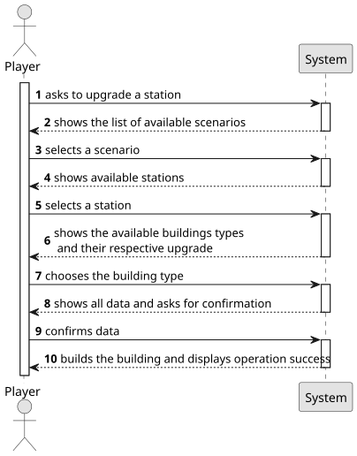

# US006 - Upgrade a station

## 1. Requirements Engineering

### 1.1. User Story Description

As a Player, I want to upgrade a selected station with a building.
Each type of station improvement has a date from which it is available.
Some equipments are mutually exclusive (e.g., small and grand hotel), and some equipments/buildings
replace others (the telegraph was initially used to facilitate the operation of trains at stations, and was later
replaced by the telephone, so after the advent of telephone, telegraph is no more available).

### 1.2. Customer Specifications and Clarifications 

>As a user with the Player role, I should be able to upgrade an existing station, adding a building to it. To do so, a station must be selected as well as the type of building wanted. Furthermore, some upgrades are historically restricted, some are not available at the same time and some work as replacements.

**From the client clarifications:**

>**Question**: "In the statement, the example of a small hotel and a large hotel is given as mutually exclusive upgrades. Does this mean that all upgrades of the same type are always mutually exclusive? Or, for example, is it possible to have more than one liquid storage unit at the same station?"
>
> **Answer**: "There are mutually exclusive buildings such as the small restaurant and the large restaurant."

> **Question**: "In addition, I would like to confirm whether it is possible to have multiple buildings of different types in the same station. For example, can we have a small café, a large hotel and a post office at the same time? If this is allowed, is there a maximum limit to the number of buildings in each station?
If there is, does it vary according to the type of station (Depot, Station or Terminal)?
Are all combinations of buildings allowed? For example, is the player free to choose to have the upgrades: customs + silo + telegraph in the same station?"
> 
>  **Answer**: "There are buildings that can no longer be built when they come into existence, for example, the telegraph has been replaced by the telephone. Stations that have a telegraph continue to operate with the telegraph until a telephone is built to replace the telegraph. Once there is a telephone, it is no longer possible to build a telegraph.
There can't be multiple identical buildings (for example, I can't have three grain silos).
Combinations, as long as they respect the above restrictions, are all possible."

### 1.3. Acceptance Criteria

* **AC1:** There are buildings that can no longer be built when they come into existence. You can't have two of the same type of upgrade from different
technological ages, for example, when you have a telephone upgrade, you cannot buy the telegraph upgrade.
* **AC2:** There cannot be two of the same of upgrade.
* **AC3:** There are mutually exclusive upgrades, for example, the big and the small hotel.

### 1.4. Found out Dependencies

* There is a dependency on US001 as there needs to be a map already created, US004 because the scenario restrictions define which buildings are available and US005 as there must be at least one station to upgrade.

### 1.5 Input and Output Data

**Input Data:**

* Typed data:
    * the request 
	
* Selected data:
    * a scenario
    * a station 
    * a building type

**Output Data:**

* List of available scenarios
* List of existing stations
* List of available buildings types
* Data for confirmation
* (In)Success of the operation

### 1.6. System Sequence Diagram (SSD)

**_Other alternatives might exist._**

### 1.7 Other Relevant Remarks
