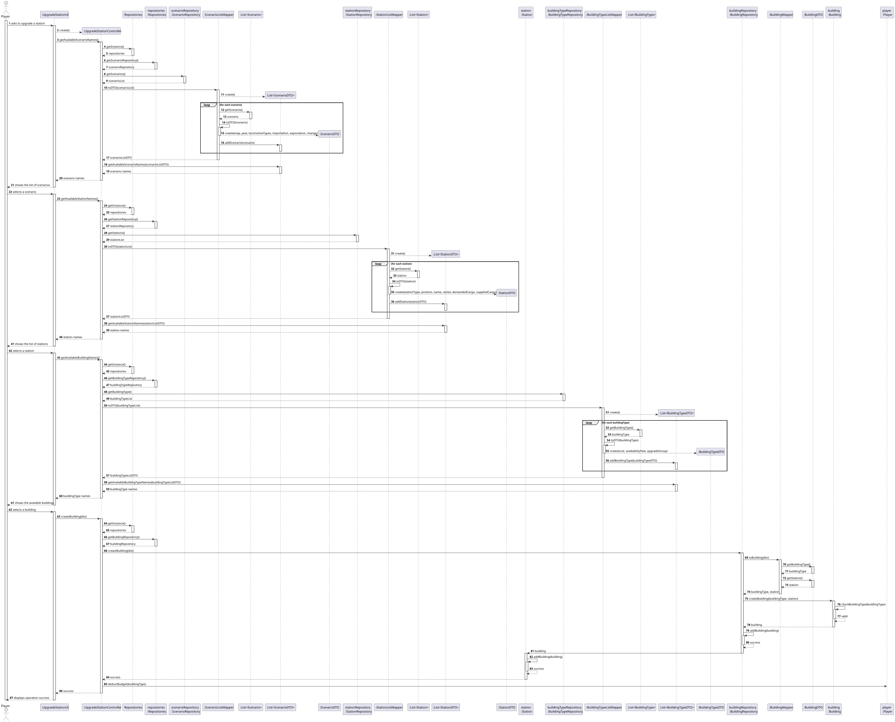
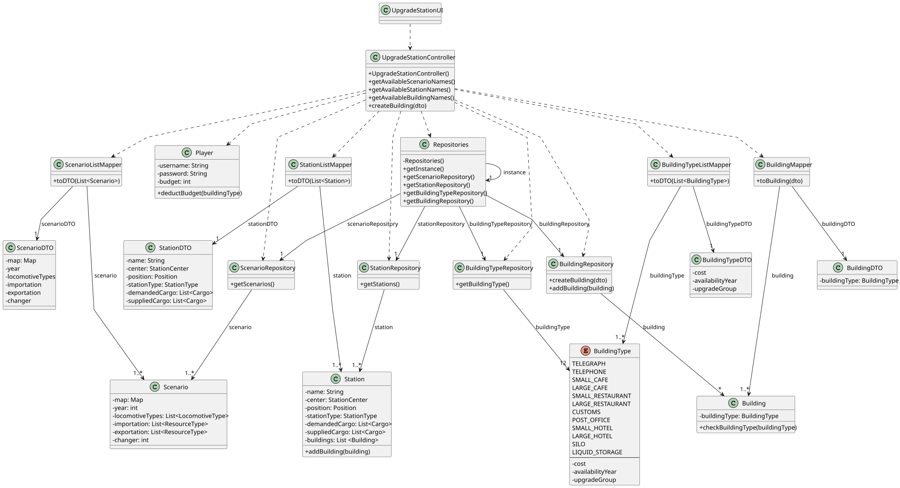

# US006 - Upgrade a station

## 3. Design

### 3.1. Rationale

| **Interaction ID** | **Question: Which class is responsible for...**                           | **Answer**                                                          | **Justification (with patterns)**                                                                                                              |
|--------------------|---------------------------------------------------------------------------|---------------------------------------------------------------------|------------------------------------------------------------------------------------------------------------------------------------------------|
| 1–4                | Handling user input and initiating the station upgrade use case           | `:UpgradeStationUI`                                                 | **Controller (UI Layer)** – Manages all direct interaction with the Player, including input and displaying options.                            |
| 5–30               | Coordinating the upgrade workflow and delegating repository/mapping tasks | `:UpgradeStationController`                                         | **Controller** – Central application coordinator, receives input from UI and delegates to repositories, domain objects, and mappers.           |
| 6, 12, 18, 24, 30  | Providing singleton access to all repositories                            | `Repositories`                                                      | **Pure Fabrication (Singleton)** – Gives access to repositories with low coupling; avoids injecting multiple dependencies into the controller. |
| 7, 13              | Accessing scenario data                                                   | `scenarioRepository : ScenarioRepository`                           | **Information Expert** – Handles retrieval of scenario data; knows how to find and store Scenario objects.                                     |
| 8, 14              | Accessing station data                                                    | `stationRepository : StationRepository`                             | **Information Expert** – Repository responsible for accessing Station entities used in the upgrade process.                                    |
| 9, 15              | Accessing building types                                                  | `buildingTypeRepository : BuildingTypeRepository`                   | **Information Expert** – Repository holding valid BuildingType definitions.                                                                    |
| 10, 16, 22         | Accessing building data and saving upgraded building                      | `buildingRepository : BuildingRepository`                           | **Creator** – Responsible for instantiating and persisting new Building objects.                                                               |
| 11, 17, 23         | Mapping lists of domain objects to DTOs for UI display                    | `ScenarioListMapper`, `StationListMapper`, `BuildingTypeListMapper` | **Pure Fabrication** – Converts complex domain objects to simple UI-facing DTOs; avoids exposing domain internals to UI.                       |
| 19–21              | Holding and managing collections of DTOs                                  | `List<ScenarioDTO>`, `List<StationDTO>`, `List<BuildingTypeDTO>`    | **Information Expert** – Responsible for storing and providing access to data displayed in the UI.                                             |
| 25–27              | Mapping `BuildingDTO` back into domain object                             | `BuildingMapper`                                                    | **Pure Fabrication** – Converts DTO input back into a domain Building object for processing and validation.                                    |
| 28–29              | Validating building upgrade and associating with station                  | `Building`, `Station`                                               | **Information Expert** – `Building` validates upgrade rules; `Station` knows how to attach the building and update its state.                  |
| 31–36              | Persisting updated station and player data                                | `stationRepository`, `scenarioRepository`, `Player`                 | **Creator** (Repositories) – Save updated domain data. **Information Expert** (Player) – Knows and updates budget based on upgrade cost.    |
| 37–39              | Returning success or failure to the user                                  | `:UpgradeStationController`, `:UpgradeStationUI`                    | **Controller** and **UI Controller** – Inform the user of upgrade success/failure.                                                             |

### Systematization ##

According to the taken rationale, the conceptual classes promoted to software classes are: 

* Scenario
* Station
* Building
* BuildingType 
* Player

Other software classes (i.e. Pure Fabrication) identified: 

* UpgradeStationUI  
* UpgradeStationController
* Repositories
* ScenarioRepository
* StationRepository
* BuildingRepository
* BuildingTypeRepository
* ScenarioListMapper
* StationListMapper
* BuildingTypeListMapper
* BuildingMapper
* ScenarioDTO
* StationDTO
* BuildingTypeDTO
* BuildingDTO

## 3.2. Sequence Diagram (SD)

### Full Diagram

This diagram shows the full sequence of interactions between the classes involved in the realization of this user story.

## 3.3. Class Diagram (CD)

