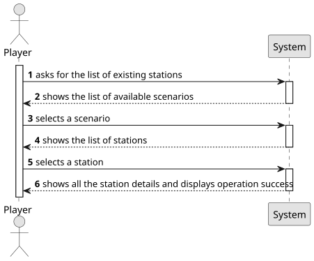

# US007 - View Station Details

## 1. Requirements Engineering

### 1.1. User Story Description

As a Player, I want to list all the stations to select one to see its details, including the existing building and the demand/supply cargoes.

### 1.2. Customer Specifications and Clarifications 

**From the specifications document:**

>The Player wants to view a list of all stations that are available to select and see its details, like the station's name, location and status (active or inactive). He wants to check the buildings that already exist, their types and their functions. He also wants to see the cargo information, like the types and quantities the station demands and supllies.

**From the client clarifications:**

> **Question**: "When the user selects an existing station, does it automatically show all the associated info to that station or the user selects the station then has to select the required option ? eg: 'show details'"
> 
> **Answer**: "That's a matter of UX/UI, each team can decide what works best."

### 1.3. Acceptance Criteria

There's no Acceptance Criteria for this US.

### 1.4. Found out Dependencies

* There is a dependency on US005 and US006 as the simulation must already have stations and buildings.

### 1.5 Input and Output Data

**Input Data:**

* Typed data:
  * the request

* Selected data:
  * a scenario 
  * a station

**Output Data:**

* List of available scenarios
* List of existing stations
* Details of the selected station
* (In)Success of the operation

### 1.6. System Sequence Diagram (SSD)

**_Other alternatives might exist._**

### 1.7 Other Relevant Remarks

* No other relevant remarks