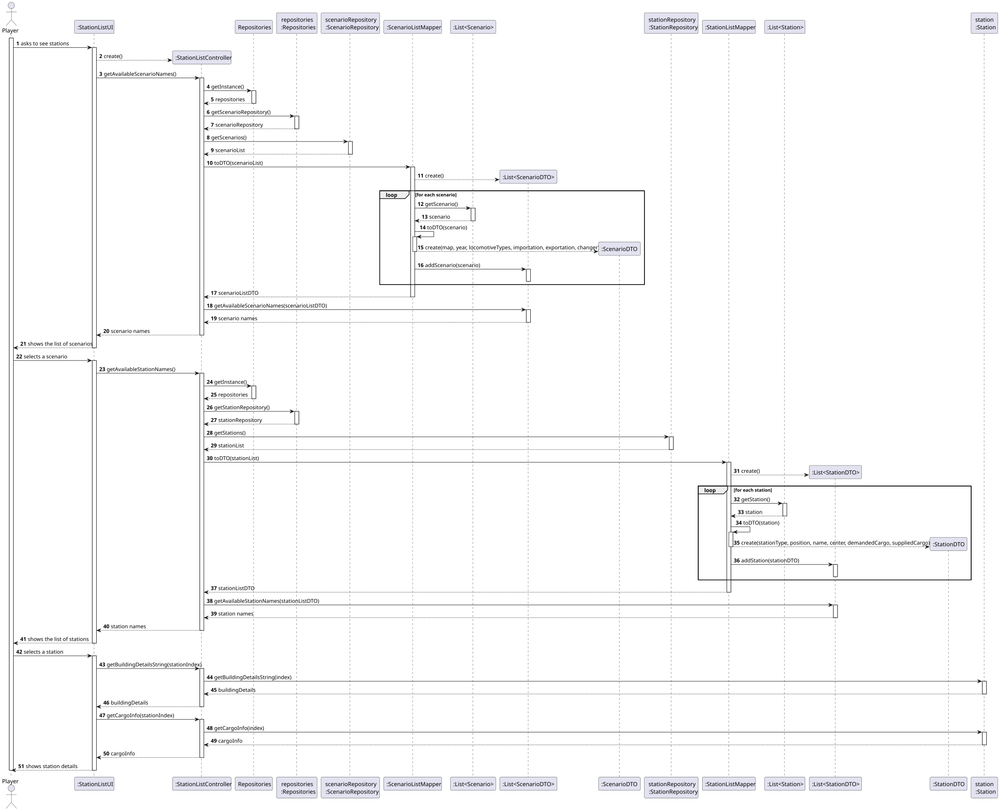
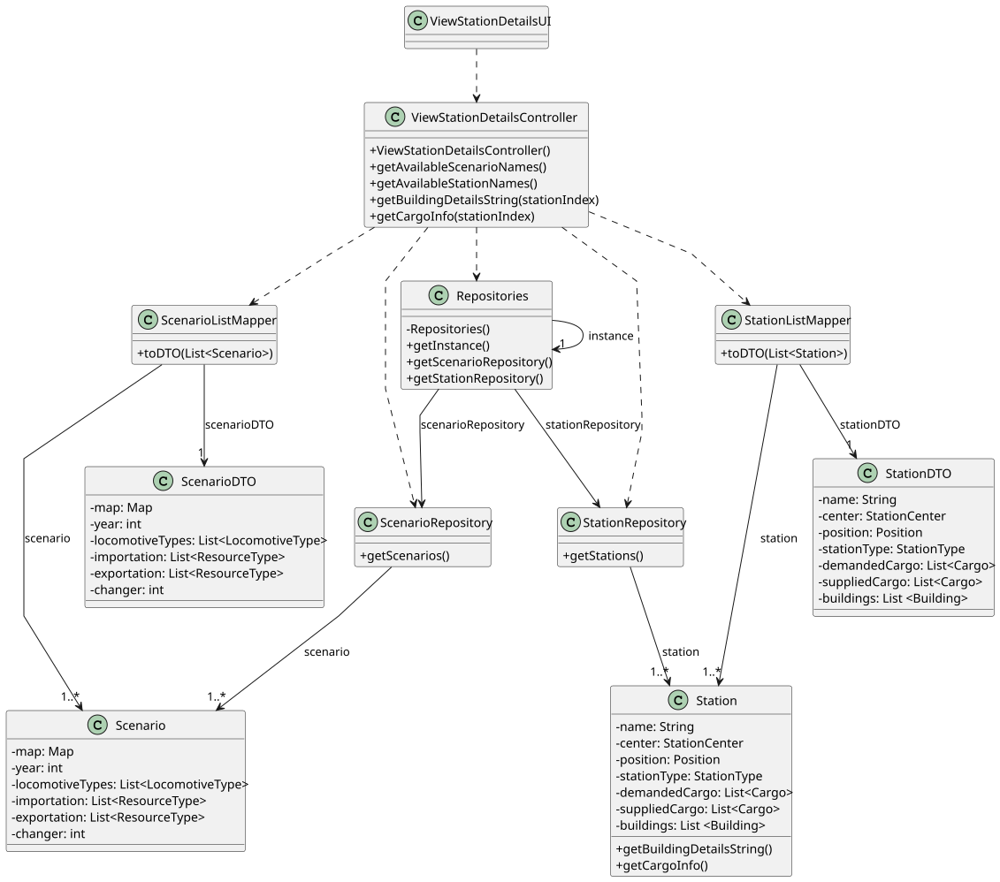

# US007 - View Station Details

## 3. Design

### 3.1. Rationale

| **Interaction ID(s)** | **Question: Which class is responsible for...**                       | **Answer**                                 | **Justification (with GRASP and Design Patterns)**                                               |
|-----------------------|-----------------------------------------------------------------------|--------------------------------------------|--------------------------------------------------------------------------------------------------|
| 1–4                   | Handling user input and initiating the use case                       | `:ViewStationDetailsUI`                    | **Controller (UI Layer)** – Captures user input and starts interaction.                          |
| 5–23                  | Coordinating scenario retrieval and sending scenario names to UI      | `:ViewStationDetailsController`            | **Controller** – Orchestrates the retrieval, mapping, and return of scenario data.               |
| 6, 12                 | Providing singleton access to repositories                            | `Repositories`                             | **Pure Fabrication** (Singleton) – Centralized factory/provider for domain repositories.         |
| 8                     | Retrieving all scenarios from storage                                 | `ScenarioRepository`                       | **Information Expert** – Knows how to access and manage `Scenario` objects.                      |
| 9–21                  | Mapping `Scenario` objects to `ScenarioDTO`                           | `ScenarioListMapper`                       | **Pure Fabrication** – Responsible for transforming domain objects into DTOs.                    |
| 24–26                 | Handling the player’s selection of a scenario                         | `:ViewStationDetailsUI`                    | **Controller (UI Layer)** – Captures and forwards scenario choice.                               |
| 27–53                 | Coordinating station retrieval and returning station names to UI      | `:ViewStationDetailsController`            | **Controller** – Retrieves station data for selected scenario and maps it.                       |
| 29, 35                | Accessing the station repository                                      | `Repositories`, `StationRepository`        | **Pure Fabrication** + **Information Expert** – Provides access to station data.                 |
| 36–50                 | Mapping `Station` domain objects to `StationDTO`                      | `StationListMapper`                        | **Pure Fabrication** – Handles transformation from domain model to DTO.                          |
| 54–55                 | Handling the player’s selection of a station                          | `:ViewStationDetailsUI`                    | **Controller (UI Layer)** – Captures and forwards user’s station selection.                      |
| 56–60                 | Retrieving and returning building details of the selected station     | `:ViewStationDetailsController`, `Station` | **Controller** + **Information Expert** – Controller coordinates; `Station` knows its buildings. |
| 61–65                 | Retrieving and returning cargo details of the selected station        | `:ViewStationDetailsController`, `Station` | **Controller** + **Information Expert** – Controller coordinates; `Station` knows its cargo.     |
| 66                    | Displaying complete station details (buildings + cargo) to the player | `:ViewStationDetailsUI`                    | **Controller (UI Layer)** – Presents result back to the player.                                  |

### Systematization ##

According to the taken rationale, the conceptual classes promoted to software classes are: 

* Scenario
* Station
* Player

Other software classes (i.e. Pure Fabrication) identified: 

* ViewStationUI
* ViewStationController
* Repositories
* ScenarioRepository
* StationRepository
* ScenarioListMapper
* StationListMapper
* ScenarioDTO
* StationDTO

## 3.2. Sequence Diagram (SD)

### Full Diagram

This diagram shows the full sequence of interactions between the classes involved in the realization of this user story.

## 3.3. Class Diagram (CD)

