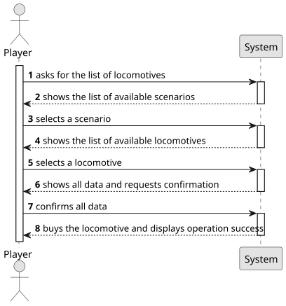

# US009 - Buy a Locomotive

## 1. Requirements Engineering

### 1.1. User Story Description

As a Player, I want to buy a locomotive.

### 1.2. Customer Specifications and Clarifications 

**From the specifications document:**

>	The Player wants to buy a train which he must choose the locomotive from a list of locomotives that are available for the scenario as well as a current date 

**From the client clarifications:**

> **Question**: "I have verified that in the US in reference, there is a dependency referring to a list of locomotives available for the current scenario and date. However, I haven't found any specific User Story that deals with the construction or display of this list. Will this list functionality be detailed in a future US?"
>
> **Answer**: "The locomotives that will be presented in the selection list are restricted to the current date and any restrictions that may have been defined in the scenario.
The presentation of the list of locomotives is part of US009."

> **Question**: "Can a player buy the same train multiple times?"
> 
>  **Answer**: "The same type of locomotive, yes; but these locomotives will have unique identification (like a plate or a serial number)."

> **Question**: "Is there a limit to how many trains a player can own, like an inventory that can get full?"
>
> **Answer**: "There is no physical limit, just the available memory."
 
> **Question**: "How is the availability of locomotives determined?"
> 
> **Answer**: "Each locomotive model has a one-year entry into service period, after which it becomes available for purchase."

> **Question**: "Monetary data is expressed in any particular currency?"
> 
> **Answer**: "An abstract one."

> **Question**: "What happens if the player does not have enough budget to buy a locomotive?"
> 
> **Answer**: "He can't buy! Bonds and loans will not be considered right now."
 
> **Question**: "Is there a limit to the number of locomotives a player can buy?"
> 
> **Answer**: "No limit."

### 1.3. Acceptance Criteria

* AC01: The player should choose the locomotive from a list of available locomotives for the scenario as well as a current date.

### 1.4. Found out Dependencies

* There is a dependency on US004, as the available locomotives are different from scenario to scenario.

### 1.5 Input and Output Data

**Input Data:**

* Typed data:
    * the request

* Selected data:
    * a scenario  
    * a locomotive

**Output Data:**

* List of available scenarios
* List of available locomotives
* Data for confirmation
* (In)Success of the operation

### 1.6. System Sequence Diagram (SSD)

**_Other alternatives might exist._**

### 1.7 Other Relevant Remarks
