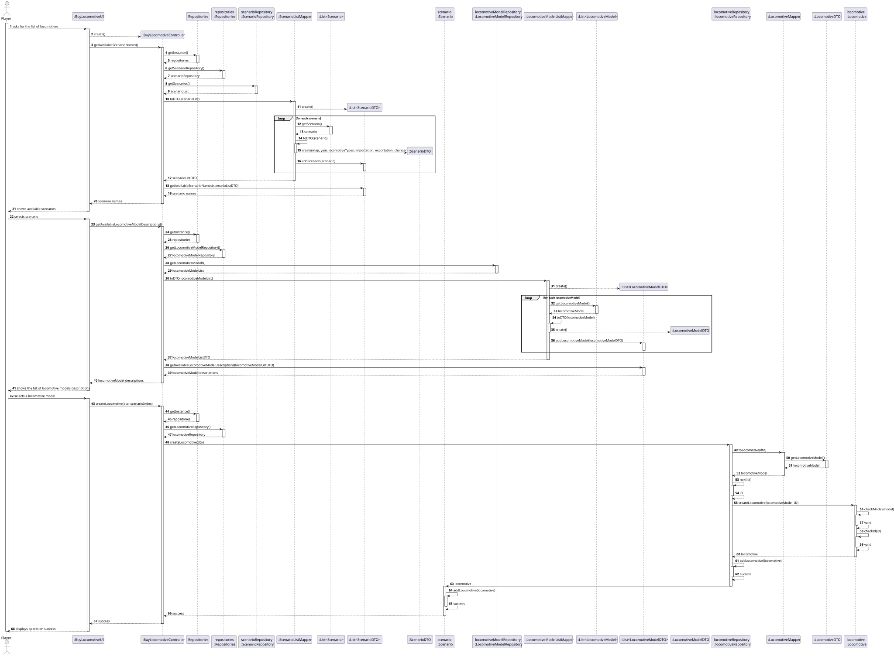
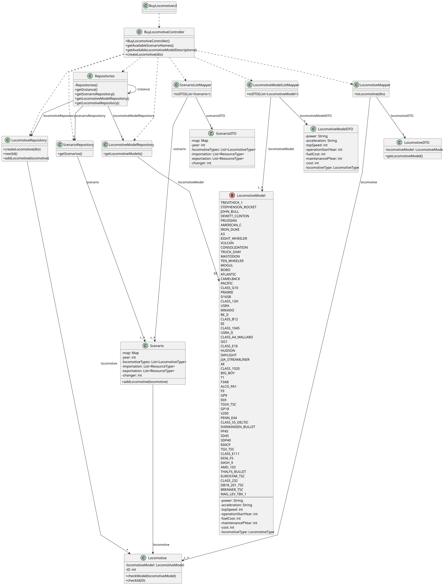

# US009 - Buy A Locomotive

## 3. Design

### 3.1. Rationale

| **Interaction ID(s)** | **Question: Which class is responsible for...**                             | **Answer**                             | **Justification (with patterns)**                                                        |
|-----------------------|-----------------------------------------------------------------------------|----------------------------------------|------------------------------------------------------------------------------------------|
| 1–5                   | Handling user input and initiating the use case                             | `:BuyLocomotiveUI`                     | **Controller (UI Layer)** – Captures player input and starts the interaction.            |
| 6–10                  | Coordinating scenario retrieval and returning names to UI                   | `:BuyLocomotiveController`             | **Controller** – Orchestrates the scenario listing and communicates with the repository. |
| 11                    | Providing access to repositories                                            | `Repositories`                         | **Pure Fabrication (Singleton)** – Central access point for repositories.                |
| 12                    | Retrieving available scenarios                                              | `ScenarioRepository`                   | **Information Expert** – Responsible for storing and retrieving Scenario entities.       |
| 13–21                 | Mapping domain scenarios to DTOs (`ScenarioDTO`)                            | `ScenarioListMapper`                   | **Pure Fabrication** – Responsible for converting domain objects to DTOs.                |
| 22                    | Returning list of `ScenarioDTO` to UI                                       | `:BuyLocomotiveController`             | **Controller** – Sends mapped data back to the UI.                                       |
| 23–27                 | Handling user scenario selection                                            | `:BuyLocomotiveUI`                     | **Controller (UI Layer)** – Collects and forwards user selection to the controller.      |
| 28–30                 | Requesting locomotive models from scenario                                  | `:BuyLocomotiveController`, `Scenario` | **Controller** + **Information Expert** – Scenario knows which models are available.     |
| 31–41                 | Mapping domain models to DTOs (`LocomotiveModelDTO`)                        | `LocomotiveModelListMapper`            | **Pure Fabrication** – Converts domain `LocomotiveModel` objects to DTOs.                |
| 42                    | Returning list of `LocomotiveModelDTO` to UI                                | `:BuyLocomotiveController`             | **Controller** – Returns list of mapped DTOs.                                            |
| 43–46                 | Handling player’s model selection and budget input                          | `:BuyLocomotiveUI`                     | **Controller (UI Layer)** – Captures user selection and budget.                          |
| 47–49                 | Passing selected `Scenario`, `LocomotiveModelDTO`, and budget to controller | `:BuyLocomotiveUI`                     | **Controller (UI Layer)** – Forwards structured data to domain-level logic.              |
| 50–52                 | Creating `LocomotiveDTO` from input DTO and data                            | `:BuyLocomotiveController`             | **Controller** – Combines input to trigger domain object creation.                       |
| 53–56                 | Converting DTO to domain object (`Locomotive`)                              | `LocomotiveMapper`                     | **Pure Fabrication** – Converts DTOs into domain model objects.                          |
| 57                    | Accessing `LocomotiveRepository`                                            | `Repositories`                         | **Pure Fabrication (Singleton)** – Central repository access.                            |
| 58–60                 | Creating and storing the `Locomotive`                                       | `LocomotiveRepository`                 | **Creator** – Responsible for constructing and saving new locomotives.                   |
| 61                    | Returning the created `Locomotive` (or success confirmation) to controller  | `LocomotiveRepository`                 | **Information Expert** – Owns and returns newly created object.                          |
| 62–63                 | Presenting purchase result to the user                                      | `:BuyLocomotiveUI`                     | **Controller (UI Layer)** – Displays final result to the player.                         |

### Systematization ##

According to the taken rationale, the conceptual classes promoted to software classes are: 

* Scenario
* Locomotive
* LocomotiveModel
* Player

Other software classes (i.e. Pure Fabrication) identified: 

* BuyLocomotiveUI
* BuyLocomotiveController
* Repositories
* ScenarioRepository
* LocomotiveModelRepository
* LocomotiveRepository
* ScenarioListMapper
* ScenarioDTO
* LocomotiveModelListMapper
* LocomotiveModelDTO
* LocomotiveDTO
* LocomotiveMapper

## 3.2. Sequence Diagram (SD)

### Full Diagram

This diagram shows the full sequence of interactions between the classes involved in the realization of this user story.

## 3.3. Class Diagram (CD)

