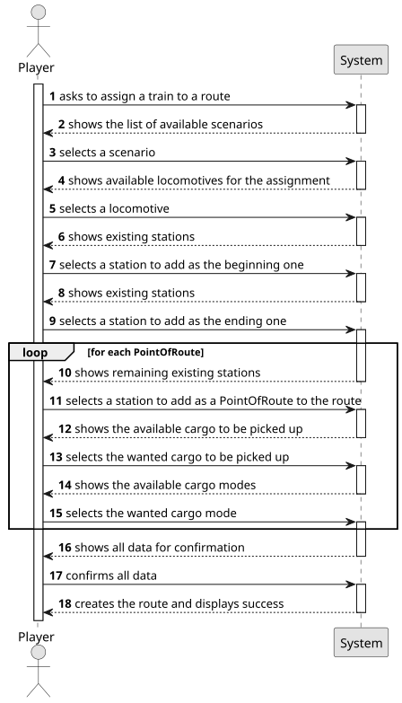

# US010 - Route Selection

## 1. Requirements Engineering

### 1.1. User Story Description

As a Player, I want to assign a selected train to a route. A
route is a list of Points-of-Route, each Point-of-Route is defined by: a
station, a list of cargoes to be picked up.

### 1.2. Customer Specifications and Clarifications 

**From the specifications document:**

>As a user with the Player role, I should be able to choose a train from the list and assign in to a route. This route should include a valid station as a stop for the train. 
In the station, there should be a list of cargoes to be picked up by the train.

**From the client clarifications:**

> **Question**: "A route is a list of stations where the train passes. If there are many stations but no railway lines, are we able to create a route?"
>
> **Answer**: "If there is no path between any pair of consecutive points of the route, the player should be warned, then the player can opt between cancel/proceed."

> **Question**: "Can multiple cargo types be assigned to the same train?"
> 
> **Answer**: "Yes."

> **Question**: "Does a route have a limit of stations that can be assigned?"
>
> **Answer**: "No."

### 1.3. Acceptance Criteria

* AC01: If the selected route isn't connected by railways, it can't be created.
* AC02: For each Point-of-Route I want to assign a cargo mode, that
  can be: FULL (the train only departs when full loaded); HALF (the
  train departs as soon it haves half of carriages loaded); AVAILABLE
  (the train departs with available cargoes in the station)

### 1.4. Found out Dependencies

* There is an inherent dependency in US001, US005, US008 and US009 as this one needs a map, at least two stations, railways and 
 a train to exist so that it can be run.

### 1.5 Input and Output Data

**Input Data:**

* Typed data:
    * the request         
	
* Selected data:
    * a scenario
    * a locomotive
    * a beginning station
    * an ending station
    * stops
    * cargo
    * a mode

**Output Data:**

* List of available scenarios
* List of available locomotives
* List of existing stations
* List of available cargo
* Data for confirmation
* (In)Success of the operation

### 1.6. System Sequence Diagram (SSD)

**_Other alternatives might exist._**

### 1.7 Other Relevant Remarks

* No other relevant remarks