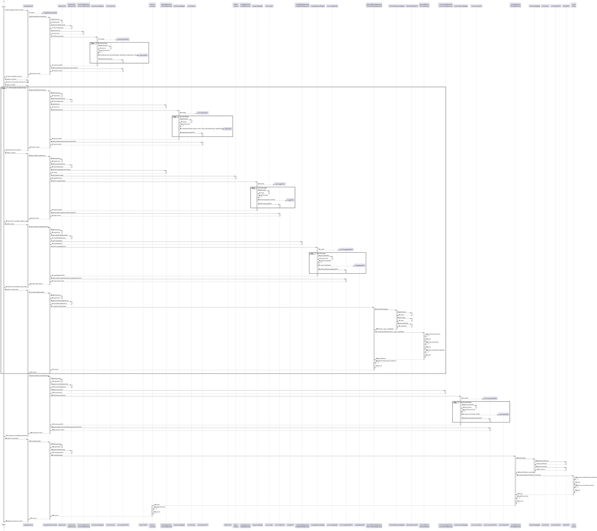
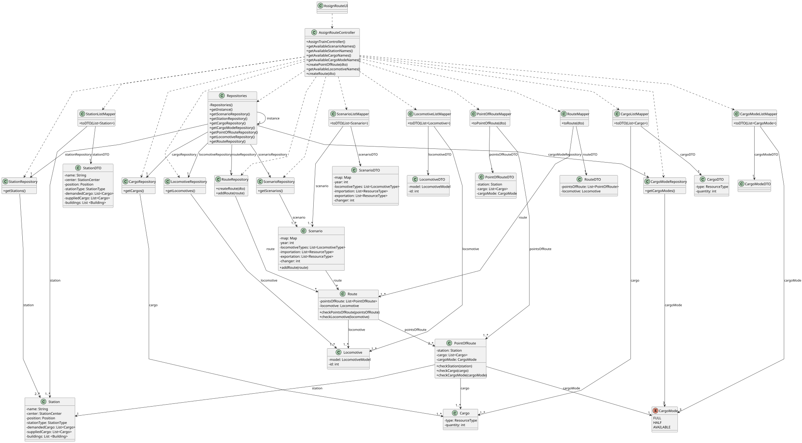

# US010 - Route Selection

## 3. Design

### 3.1. Rationale

| **Interaction ID** | **Question: Which class is responsible for...**                          | **Answer**                              | **Justification (with patterns)**                                                          |
|--------------------|--------------------------------------------------------------------------|-----------------------------------------|--------------------------------------------------------------------------------------------|
| 1–3                | Handling user input and initiating the assign route process              | `:AssignRouteUI`                        | **Controller (UI Layer)** – Handles user interaction and forwards actions to controller.   |
| 4–14               | Coordinating scenario, station, locomotive, and route-related operations | `:AssignRouteController`                | **Controller** – Orchestrates the entire use case, interacts with repositories and domain. |
| 5, 6, 8, 13        | Providing access to repository instances                                 | `Repositories`                          | **Pure Fabrication (Singleton)** – Centralizes access to repositories.                     |
| 6–7                | Accessing scenario data from storage                                     | `ScenarioRepository`                    | **Information Expert** – Knows how to retrieve and provide Scenario objects.               |
| 7–9                | Mapping Scenario to DTO for display                                      | `ScenarioListMapper`, `ScenarioDTO`     | **Pure Fabrication** – Converts domain objects to DTOs for presentation in UI.             |
| 9–10               | Storing the selected scenario and accessing its domain info              | `:AssignRouteUI`, `Scenario`            | **IE** – UI stores selection; Scenario knows about its lines and station connections.      |
| 11–12              | Accessing available locomotives                                          | `LocomotiveRepository`                  | **Information Expert** – Provides list of locomotive models relevant to the scenario.      |
| 13–14              | Mapping Locomotives to DTOs                                              | `LocomotiveListMapper`, `LocomotiveDTO` | **Pure Fabrication** – Converts domain locomotives to DTOs for UI.                         |
| 15–16              | Selecting and storing chosen locomotive                                  | `:AssignRouteUI`                        | **IE** – Stores user’s locomotive choice for use in route creation.                        |
| 17–18              | Accessing list of all stations                                           | `StationRepository`                     | **Information Expert** – Manages all Station data and retrieval.                           |
| 19–20              | Mapping Stations to DTOs                                                 | `StationListMapper`, `StationDTO`       | **Pure Fabrication** – Maps domain Stations to DTOs for user selection.                    |
| 21–22              | Selecting and storing chosen stations for the route                      | `:AssignRouteUI`                        | **IE** – Maintains station sequence selected by player.                                    |
| 23–24              | Validating station connectivity for route feasibility                    | `Scenario`                              | **IE** – Knows the structure of the map and connection rules between stations.             |
| 25–26              | Checking available cargo at each station                                 | `Station`                               | **Information Expert** – Each Station knows its cargo inventory.                           |
| 27–28              | Mapping available cargo to DTOs                                          | `CargoListMapper`, `CargoDTO`           | **Pure Fabrication** – Converts domain cargo to DTOs for presentation.                     |
| 29–30              | Selecting and storing chosen cargo                                       | `:AssignRouteUI`                        | **IE** – Stores the cargo list selected by the player.                                     |
| 31–32              | Displaying confirmation screen and gathering user consent                | `:AssignRouteUI`                        | **Controller (UI Layer)** – Manages confirmation before final route creation.              |
| 33–36              | Creating and persisting the new Route                                    | `Route`, `:AssignRouteController`       | **Creator + Controller** – `Route` owns stations, cargo, locomotive; Controller saves it.  |
| 37–38              | Mapping selected DTOs to domain objects                                  | `RouteMapper`                           | **Pure Fabrication** – Converts DTOs into domain-level `Route` with all required info.     |
| 39–40              | Persisting the route into the scenario or system                         | `AssignRouteController`, `Scenario`     | **IE** – Scenario maintains list of assigned routes; controller initiates update.          |
| 41–42              | Notifying the player about operation success                             | `:AssignRouteUI`                        | **Controller (UI Layer)** – Provides final user feedback.                                  |

### Systematization ##

According to the taken rationale, the conceptual classes promoted to software classes are: 

* Scenario
* Station
* Cargo
* CargoMode
* PointsOfRoute
* Route
* Locomotive

Other software classes (i.e. Pure Fabrication) identified: 

* AssignRouteUI
* AssignRouteController
* Repositories
* ScenarioRepository
* StationRepository
* CargoRepository
* CargoModeRepository
* PointsOfRouteRepository
* LocomotiveRepository
* RouteRepository
* ScenarioListMapper
* StationListMapper
* CargoListMapper
* CargoModeListMapper
* PointsOfRouteListMapper
* RouteListMapper
* ScenarioDTO
* StationDTO
* CargoDTO
* CargoModeDTO
* PointsOfRouteDTO
* LocomotiveDTO
* RouteDTO

## 3.2. Sequence Diagram (SD)

### Full Diagram

This diagram shows the full sequence of interactions between the classes involved in the realization of this user story.

## 3.3. Class Diagram (CD)

