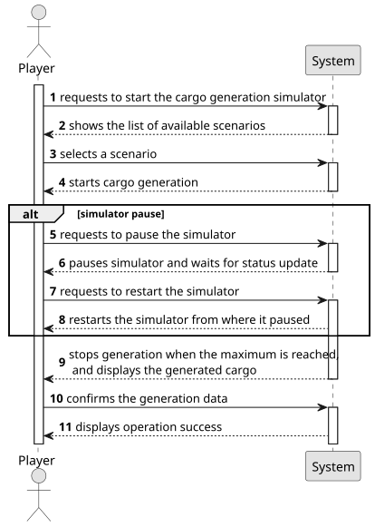

# US012 - Simulate Cargo Generation

## 1. Requirements Engineering

### 1.1. User Story Description

As a Player, I want to create a simulator that generates
cargoes at current stations, automatically, considering the cities and
industries that the railway network serves.

### 1.2. Customer Specifications and Clarifications 

**From the specifications document:**

>As a user with the Player role, I should be able to start a simulation of cargo. This simulation consists in gathering information, such as the cities and industries available for cargo generation covered by the railway and the stations where the cargo should appear, and simulate at user command with the start and pause input.
 

**From the client clarifications:**

> **Question**: "Is the simulation run map by map or for all existing maps?
Example: You choose to run the simulation alone on the Lisbon city map but not on the Paris map. Or would you necessarily have to run it on all the maps?
If it's map by map, how does that work? Does it run on the map the Product Owner is on? Does the Product Owner select which maps he wants to run the simulation on?"
> 
> **Answer**: "In the context of simulation, the player chooses a scenario to play, and a map must be associated with the scenario."

> **Question**: "When the Product Owner pauses is this pause local to a specific scenario or to all scenarios? Is this pause for one map or for all?"
>
> **Answer**: "Running the simulator for a scenario is called a simulation."

> **Question**: "Should the simulator run in real-time or in set intervals?"
> 
> **Answer**: "Not in real-time."

> **Question**: "Can users manually adjust cargo generation rates?"
>
> **Answer**: "Maybe not the Player but generation should be configurable (maybe in a config file)."

> **Question**: "Should cargo generation be influenced by train schedules?"
>
> **Answer**: "There are no train schedules!"

> **Question**: "Is there a limit to cargo storage?"
> 
> **Answer**: "24."
 
> **Question**: "How should cargo generation be done? At fixed time intervals or based on specific events (train arrival)?"
>
> **Answer**: "Accordingly to the frequency defined for the industry and house blocks by the station (the distribution along the year can be fixed or random)."

### 1.3. Acceptance Criteria

* **AC1:** This simulator should provide options for start/pause.
* **AC02:** The simulator needs to model train departures. At the time of
  departure, the time of arrival is calculated. The trains travels at the
  maximum speed of the locomotive on double track sections and at 80%
  of the maximum speed of the locomotive on single track sections. Each
  carriage degrades 5% of the locomotive’s speed up to a maximum of
  30%.
* **AC03:** The simulator needs to model train arrivals. On arrival, the
  amount to be received is calculated according to demand and the distance between the departure and arrival stations. The existing building
  in the station that affect revenues from passengers need to taken into
  account.
* **AC04:** The simulator needs to provide a message alerting when a new
  locomotive becomes available, accordingly to its start year of service.
  After that it becomes possible acquire that locomotive model.
* **AC05:** The simulator needs to generate cargoes in the stations accordingly to the House Blocks and Industry facilities served by each
 station. The number of cargoes depends in each industry type and in
 the modification rates defined in the scenario.
* **AC06:** The simulator needs to update the demand in station every year
 based in the deliveries.

### 1.4. Found out Dependencies

* There is a dependency on US005, as at least one station must exist to generate cargo and US010 because it needs routes to do the transportation of cargo.

### 1.5 Input and Output Data

**Input Data:**

* Typed data:
    * the request
    * a number of days to simulate
	
* Selected data:
    * a scenario
    * routes

**Output Data:**

* List of available scenarios
* List of available routes
* Simulation status (running/paused)
* Generated cargo 
* (In)Success of the operation

### 1.6. System Sequence Diagram (SSD)

**_Other alternatives might exist._**

### 1.7 Other Relevant Remarks

