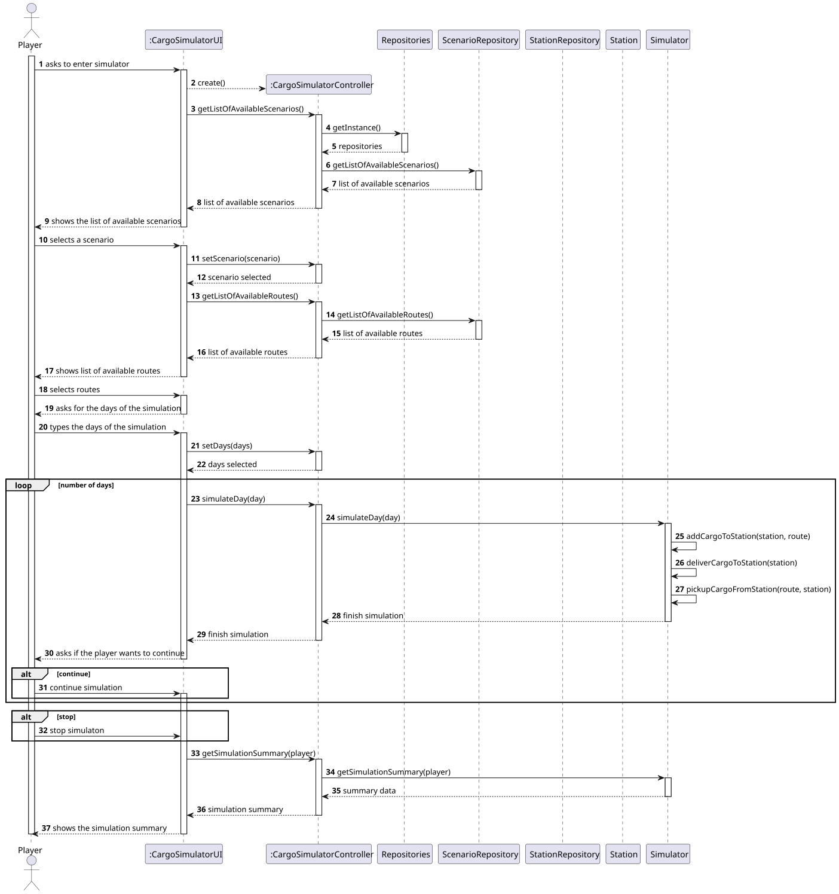
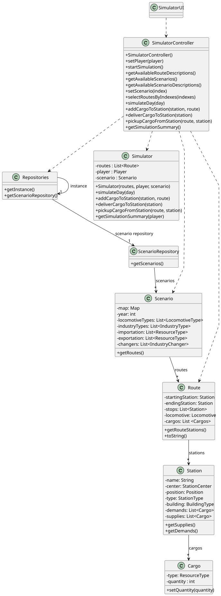

# US012 - Simulate Cargo Generation

## 3. Design

### 3.1. Rationale

| Interaction ID | Question: Which class is responsible for...    | Answer                   | Justification (with patterns)                                                             |
|----------------|------------------------------------------------|--------------------------|-------------------------------------------------------------------------------------------|
| Step 1         | ... interacting with the actor?                | CargoSimulatorUI         | Pure Fabrication: no domain class is naturally responsible for interaction with the user. |
|                | ... coordinating the US?                       | CargoSimulatorController | Controller: central coordinator of the use case logic.                                    |
|                | ... knowing the user using the system?         | Player                   | IE: knows its own data (e.g. username, password, budget).                                 |
| Step 2         | ... knowing all existing scenarios to show?    | ScenarioRepository       | IE: responsible for providing access to scenarios.                                        |
|                | ... managing access to repositories?           | Repositories             | IE: manages access to repository instances.                                               |
| Step 3         | ... saving the selected scenario?              | CargoSimulatorUI         | IE: stores selected scenario as part of the use case logic state.                         |
| Step 4         | ... requesting the available stations?         | CargoSimulatorUI         | IE: responsible for business logic coordination.                                          |
|                | ... knowing all existing stations?             | StationRepository        | IE: repository owns and manages station data.                                             |
| Step 5         | ... requesting the cargo in a set of stations? | CargoSimulatorUI         | IE: coordinates logic and delegates cargo request to domain class.                        |
|                | ... knowing the cargo in a station?            | Station                  | IE: station knows its own cargo.                                                          |
| Step 6         | ... creating the simulator?                    | CargoSimulatorController | Creator: uses the data to instantiate a new object.                                       |
|                | ... managing the state of the simulation?      | Simulator                | IE: owns and manages simulation data and logic.                                           |
| Step 7         | ... pausing/restarting the simulator?          | CargoSimulatorUI         | IE: changes state of the object.                                                          |
|                | ... tracking cargo quantity?                   | Simulator                | IE: owns and updates cargo quantities internally.                                         |
| Step 8         | ... getting updated cargo for final display?   | CargoSimulatorController | Controller: coordinates a new cargo check.                                                |
|                | ... knowing final cargo contents?              | Simulator                | IE: each station provides its own cargo.                                                  |
| Step 9         | ... informing operation success?               | CargoSimulatorUI         | IE: responsible for user interaction and final feedback.                                  |

### Systematization ##

According to the taken rationale, the conceptual classes promoted to software classes are: 

* Scenario
* Station
* Cargo
* Simulator

Other software classes (i.e. Pure Fabrication) identified: 

* CargoSimulatorUI  
* CargoSimulatorController
* Repositories
* ScenarioRepository
* StationRepository

## 3.2. Sequence Diagram (SD)

### Full Diagram

This diagram shows the full sequence of interactions between the classes involved in the realization of this user story.

### Split Diagrams

The following diagram shows the same sequence of interactions between the classes involved in the realization of this user story, but it is split in partial diagrams to better illustrate the interactions between the classes.

It uses Interaction Occurrence (a.k.a. Interaction Use).

**Get Task Category List Partial SD**

**Get Task Category Object**

**Get Employee**

**Create Task**

## 3.3. Class Diagram (CD)

