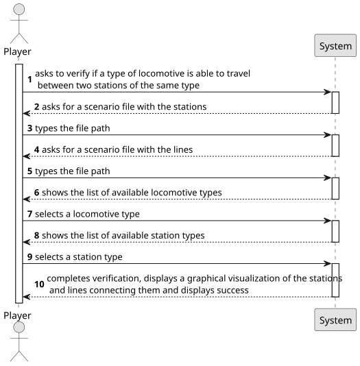

# US013 - Train Travel Verification

## 1. Requirements Engineering

### 1.1. User Story Description

As a Player, given a railway with stations and lines connecting pairs of stations, I want to verify if a specific train (steam, diesel, or electrically powered) can travel between two stations belonging to the rail network (or from any type of station to another of the same type).

### 1.2. Customer Specifications and Clarifications 

**From the specifications document:**

> As a user with the Player role, I should be able to verify if a train is able to travel between two stations. To do it, I must provide the system a scenario file with the stations and a scenario file with the lines. Furthermore, I should select the pretended verification and its result, followed by a graphical scheme of the station and lines.

**From the client clarifications:**

> **Question**: "Regarding trains with different types of fuels (steam, diesel and electricity) that work on certain types of railroad. Diesel and steam trains can work on any type of railroads, while electric trains should work exclusively on electrified railroads? If not, then which types of trains work on which types of railroads?"
>
> **Answer**: "Yes, Diesel and steam trains can work on any type of railroads, while electric trains should work exclusively on electrified railroads."

> **Question**: "Will this US be implemented as an automatic validation when the player establishes a train route between two stations? For instance: the player tries to add an electric train on a route that doesn't have electrified railroads, the game should detect that and deny the player's action? If this is incorrect, then this US is a manual verification the player can select?"
>
> **Answer**: "There is an important difference between route and path, a route is ordered list of stations that should be visited and where the cargos should be dropped and loaded, the path is the sequence of lines to be used to complete a route. So, a route can be satisfied with multiple different paths. If a route is assigned to a train and there is no possible path to accomplish the route, then a message should be raised."

> **Question**: "Are there any restrictions on which train types are allowed in certain scenarios?"
>
> **Answer**: "Yes; one can redefine the start year of service for a locomotive and also can set restriction one the type of locomotion available (or not)."

### 1.3. Acceptance Criteria

* **AC01:** The player should be able to choose the type of train (steam,
  diesel or electric) and station type (depot, station or terminal) in real
  time.
* **AC02:** A visualization of the stations, and the lines connecting stations
  of this scenario (using, for example, Graphviz or GraphStream packages) should be displayed to the player, where electrified railway lines
  are drawn with a different color from the others.
* **AC03:** All implemented procedures (except the used for graphic visualization) must use primitive operations only, and not existing functions
  in JAVA libraries.
* **AC04:** The algorithm(s) implemented to solve this problem should
  be documented/detailed in the repository documentation (using markdown format).

### 1.4. Found out Dependencies

* There is a dependency on US005 as it needs at least two stations to get their type, US008 as it needs railways and US009 because it needs a locomotive type for the verification.

### 1.5 Input and Output Data

**Input Data:**

* Typed data:
    * the request     
    * a scenario file path with the stations
    * a scenario file path with the lines 
	
* Selected data:
  * the verification
  * a locomotive type
  * a station type

**Output Data:**

* List of available locomotive types
* List of available station types
* Graphical visualization of stations and lines connecting them
* (In)Success of the operation

### 1.6. System Sequence Diagram (SSD)

**_Other alternatives might exist._**

### 1.7 Other Relevant Remarks

* No other relevant remarks