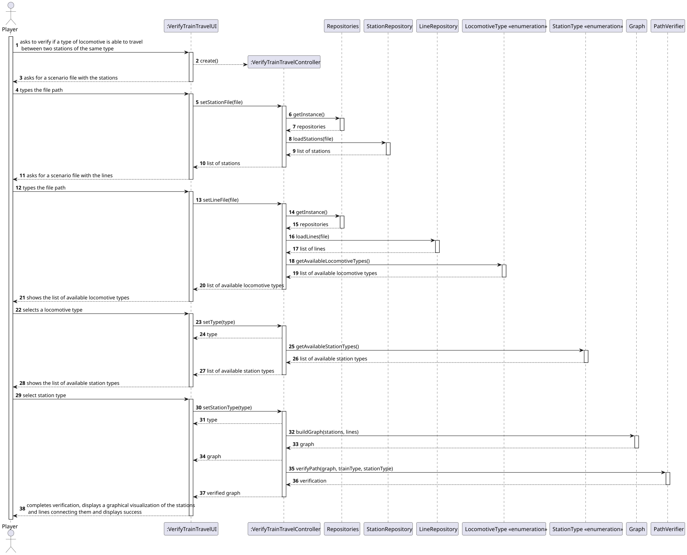
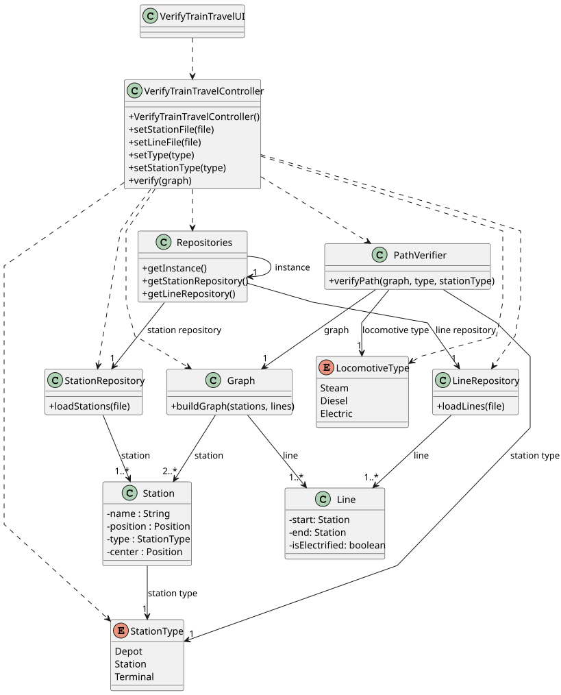

# US013 - Train Travel Verification

## 3. Design

### 3.1. Rationale

| Interaction ID | Question: Which class is responsible for...                         | Answer                      | Justification (with patterns)                                                    |
|----------------|---------------------------------------------------------------------|-----------------------------|----------------------------------------------------------------------------------|
| Step 1         | ... interacting with the actor?                                     | VerifyTrainTravelUI         | Pure Fabrication: created solely to handle user interaction.                     |
|                | ... coordinating the US?                                            | VerifyTrainTravelController | Controller: central point of control for this use case.                          |
|                | ... knowing the user using the system?                              | Player                      | IE: knows its own data (e.g. username, password, budget).                        |
| Step 2         | ... knowing all available locomotive types to show?                 | LocomotiveType              | IE: Enum containing static list of available locomotive types.                   |
| Step 3         | ... saving the selected type?                                       | VerifyTrainTravelUI         | IE: Maintains current state during the flow, including selected locomotive type. |
| Step 4         | ... showing available station types?                                | StationType                 | IE: Enum containing static list of station types.                                |
| Step 5         | ... saving the selected station type?                               | VerifyTrainTravelUI         | IE: Stores selected station type during interaction.                             |
| Step 6         | ... loading the station scenario file?                              | StationRepository           | IE: Knows how to interpret and load station data.                                |
| Step 7         | ... loading the line scenario file?                                 | LineRepository              | IE: Knows how to interpret and load line data.                                   |
| Step 8         | ... building the network graph with stations and lines?             | Graph                       | IE: Knows its structure and rules for converting stations/lines into a graph.    |
| Step 9         | ... verifying the path between stations based on train and station? | PathVerifier                | IE: Knows business rules regarding locomotive/station type constraints.          |
| Step 10        | ... storing intermediate state (files, types, results)?             | VerifyTrainTravelController | Controller: Keeps state throughout the interaction.                              |
| Step 11        | ... informing the user of operation success and displaying results? | VerifyTrainTravelUI         | IE: Responsible for displaying output and visual feedback.                       |

### Systematization ##

According to the taken rationale, the conceptual classes promoted to software classes are: 

* Station
* Line
* LocomotiveType
* StationType

Other software classes (i.e. Pure Fabrication) identified: 

* VerifyTrainTravelUI
* VerifyTrainTravelController
* Repositories
* StationRepository
* StationRepository
* PathVerifier
* Graph

## 3.2. Sequence Diagram (SD)

### Full Diagram

This diagram shows the full sequence of interactions between the classes involved in the realization of this user story.

## 3.3. Class Diagram (CD)

