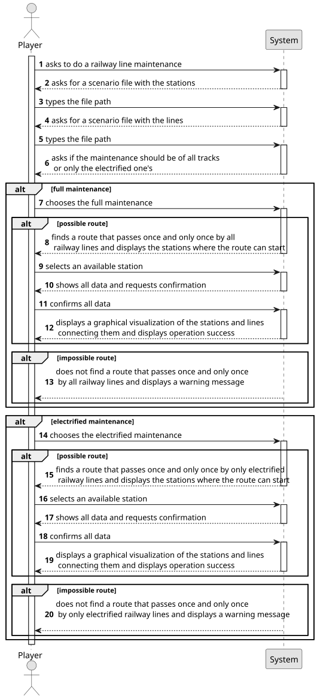

# US014 - Railway Lines Maintenance

## 1. Requirements Engineering

### 1.1. User Story Description

As a Player, given a railway with stations and railway lines, I
want to see a route that passes once, and only once, by each railway
line to carry out maintenance on the lines.

### 1.2. Customer Specifications and Clarifications 

**From the specifications document:**

> As a user with the Player role, I should be able to see a route that passes exclusively once on all railway lines, so that a global maintenance can take place. 

**From the client clarifications:**

> **Question**: "What kind of unit performs the maintenance route? Can it be any kind of train? is there a specific train configuration that needs to be set up by the player?"
>
> **Answer**: "Any kind of train will be good."

### 1.3. Acceptance Criteria

* **AC01:** The player should be able to choose between the maintenance
  of all the lines, or only the electrified ones.
* **AC02:** A warning message should be displayed in case it is not possible
  to get such route. If possible, the station(s) where the route can start,
  should be displayed so that the player may select it.
* **AC03:** A visualization of the rail network (stations, railway lines)
  should be displayed to the player (using, for example, Graphviz or
  GraphStream packages), where electrified railway lines are drawn with
  a different color from the others.
* **AC04:** All implemented procedures (except the used for graphic visualization) must only use primitive operations, and not existing functions
  in JAVA libraries.
* **AC05:** The algorithm(s) implemented to solve this problem should
  be documented/detailed in the repository documentation, using markdown format.

### 1.4. Found out Dependencies

* There is a dependency on US005 as it needs at least two stations, US008 as it needs railways and US010 because it needs a route.

### 1.5 Input and Output Data

**Input Data:**

* Typed data:
    * the request      
    * a scenario file path with the stations
    * a scenario file path with the lines
	
* Selected data:
  * a type of line for maintenance
  * a starting station

**Output Data:**

* Warning message (if no possible route)
* List of possible starting stations
* Data for confirmation
* Graphical visualization of stations and lines connecting them
* (In)Success of the operation

### 1.6. System Sequence Diagram (SSD)

**_Other alternatives might exist._**

### 1.7 Other Relevant Remarks

* No other relevant remarks