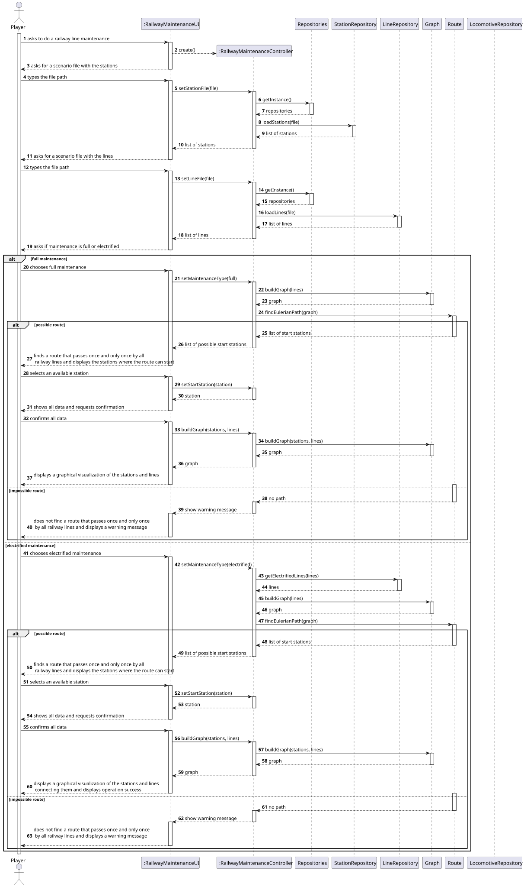
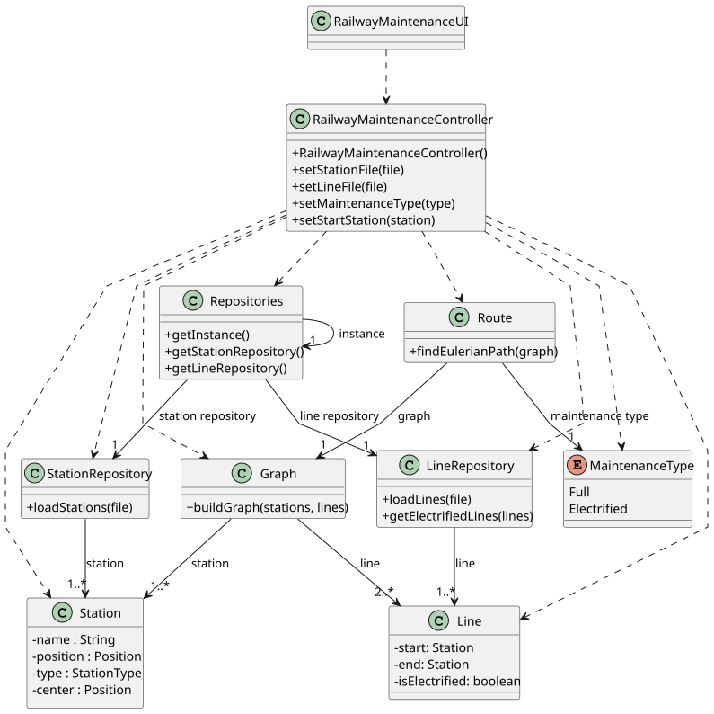

# US014 - Railway Lines Maintenance

## 3. Design

### 3.1. Rationale

| Interaction ID | Question: Which class is responsible for...                 | Answer                       | Justification (with patterns)                                                         |
|----------------|-------------------------------------------------------------|------------------------------|---------------------------------------------------------------------------------------|
| Step 1         | ... interacting with the actor?                             | RailwayMaintenanceUI         | Pure Fabrication: no domain class fits this role; UI class handles user interactions. |
|                | ... coordinating the US?                                    | RailwayMaintenanceController | Controller: coordinates the execution of this use case.                               |
|                | ... knowing the user using the system?                      | Player                       | IE: knows its own data (e.g. username, password, budget).                             |
| Step 2         | ... knowing all existing stations?                          | StationRepository            | IE: specialized in loading station data.                                              |
| Step 3         | ... knowing all existing lines?                             | LineRepository               | IE: specialized in loading line data.                                                 |
| Step 4         | ... keeping the selected maintenance type?                  | RailwayMaintenanceUI         | IE: coordinates the process and tracks selected options.                              |
| Step 5         | ... building a graph from stations and lines?               | Graph                        | IE: encapsulates logic for building and representing the network graph.               |
| Step 6         | ... computing an Eulerian path on the graph?                | Route                        | IE: knows the algorithm for route calculation.                                        |
| Step 7         | ... showing available start stations?                       | RailwayMaintenanceUI         | IE: receives data from Route and forwards it.                                         |
| Step 8         | ... saving the selected start station?                      | RailwayMaintenanceUI         | IE: responsible for tracking user input.                                              |
| Step 9         | ... knowing available locomotives?                          | LocomotiveRepository         | IE: responsible for managing locomotive availability.                                 |
| Step 10        | ... saving the selected locomotive?                         | RailwayMaintenanceUI         | IE: responsible for tracking user input.                                              |
| Step 11        | ... showing all data and requesting confirmation?           | RailwayMaintenanceUI         | IE: responsible for interacting with the user.                                        |
| Step 12        | ... assigning the locomotive to the maintenance route?      | RailwayMaintenanceController | Controller: manages logic and coordination of final operation.                        |
|                | ... displaying the visualization of the stations and lines? | RailwayMaintenanceUI         | IE: responsible for user interactions.                                                |
| Step 13        | ... handling the case where no Eulerian path is found?      | RailwayMaintenanceController | Controller: detects failure from Route and notifies UI.                               |
|                | ... informing the user about the failure?                   | RailwayMaintenanceUI         | IE: presents warning messages to the user.                                            |

### Systematization ##

According to the taken rationale, the conceptual classes promoted to software classes are: 

* Station
* Line
* Locomotive

Other software classes (i.e. Pure Fabrication) identified: 

* RailwayMaintenanceUI
* RailwayMaintenanceController
* Repositories
* StationRepository
* LineRepository
* LocomotiveRepository
* Graph
* Route

## 3.2. Sequence Diagram (SD)

### Full Diagram

This diagram shows the full sequence of interactions between the classes involved in the realization of this user story.

### Split Diagrams

The following diagram shows the same sequence of interactions between the classes involved in the realization of this user story, but it is split in partial diagrams to better illustrate the interactions between the classes.

It uses Interaction Occurrence (a.k.a. Interaction Use).

**Get Task Category List Partial SD**

**Get Task Category Object**

**Get Employee**

**Create Task**

## 3.3. Class Diagram (CD)

