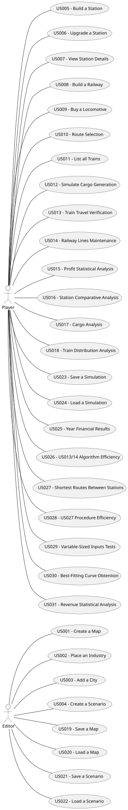

# Use Case Diagram (UCD)

# Use Cases / User Stories

| UC/US | Description                                                     |                   
|:------|:----------------------------------------------------------------|
| US001 | [Create a Map](../../US001/US001-README.md)                     |
| US002 | [Place an Industry](../../US002/US002-README.md)                |
| US003 | [Add a City](../../US003/US003-README.md)                       |
| US004 | [Create a Scenario](../../US004/US004-README.md)                |
| US005 | [Build a Station](../../US005/US005-README.md)                  |
| US006 | [Upgrade a Station](../../US006/US006-README.md)                |
| US007 | [View Station Details](../../US007/US007-README.md)             |
| US008 | [Build a Railway between Stations]()                            |
| US009 | [Buy a Locomotive](../../US009/US009-README.md)                 |
| US010 | [Route Selection](../../US010/US010-README.md)                  |
| US011 | [List all Trains]()                                             |
| US012 | [Simulate Cargo Generation](../../US012/US012-README.md)        |
| US013 | [Train Travel Verification](../../US013/US013-README.md)        |
| US014 | [Railway Lines Maintenance](../../US014/US014-README.md)        |
| US015 | [Profit Statistical Analysis](../../US015/US015-README.md)      |
| US016 | [Station Comparative Analysis](../../US016/US016-README.md)     |
| US017 | [Cargo Analysis](../../US017/US017-README.md)                   |
| US018 | [Train Distribution Analysis](../../US018/US018-README.md)      |
| US019 | [Save a Map](../../US019/US019-README.md)                       |
| US020 | [Load a Map](../../US020/US020-README.md)                       |
| US021 | [Save a Scenario](../../US021/US021-README.md)                  |
| US022 | [Load a Scenario](../../US022/US022-README.md)                  |
| US023 | [Save a Simulation](../../US023/US023-README.md)                |
| US024 | [Load a Simulation](../../US024/US024-README.md)                |
| US025 | [Year Financial Results](../../US025/US025-README.md)           |
| US026 | [US013/14 Algorithm Efficiency](../../US026/US026-README.md)    |
| US027 | [Shortest Routes Between Stations](../../US027/US027-README.md) |
| US028 | [US027 Procedure Efficiency](../../US028/US028-README.md)       |
| US029 | [Variable-Sized Inputs Tests](../../US029/US029-README.md)      |
| US030 | [Best-Fitting Curve Obtention](../../US030/US030-README.md)     |
| US031 | [Revenue Statistical Analysis](../../US031/US031-README.md)     |

