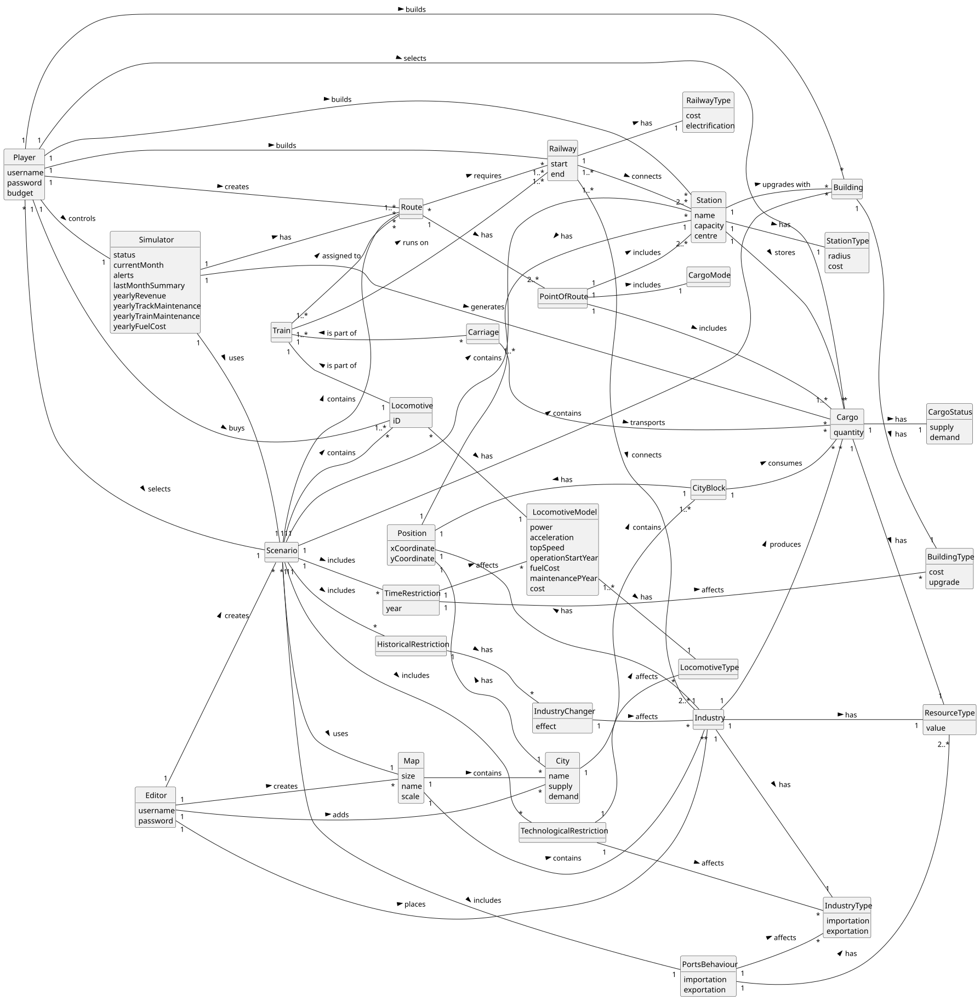

# OO Analysis

The construction process of the domain model is based on the client specifications, especially the nouns (for _concepts_) and verbs (for _relations_) used.

## Rationale to identify domain conceptual classes
To identify domain conceptual classes, start by making a list of candidate conceptual classes inspired by the list of categories suggested in the book "Applying UML and Patterns: An Introduction to Object-Oriented Analysis and Design and Iterative Development".

### _Conceptual Class Category List_

**Business Transactions**

* Scenario
* Simulator

---

**Transaction Line Items**

* Route
* Cargo
* Building

---

**Product/Service related to a Transaction or Transaction Line Item**

* Locomotive
* Railway

---

**Transaction Records**

* Scenario

---  

**Roles of People or Organizations**

* Editor
* Player
* Product Owner

---

**Places**

* City
* Industry
* Station

---

**Noteworthy Events**

* Simulator

---

**Physical Objects**

* None

---

**Descriptions of Things**

* None

---

**Catalogs**

* Locomotive
* Industry
* Station
* Scenario

---

**Containers**

* Map
* Station
* Route

---

**Elements of Containers**

* Industry
* City
* Station
* Building
* Railway
* Locomotive

---

**Organizations**

* None

---

**Other External/Collaborating Systems**

* None

---

**Records of finance, work, contracts, legal matters**

* None

---

**Financial Instruments**

* None

---

**Documents mentioned/used to perform some work/**

* None

---

## Rationale to identify associations between conceptual classes

An association is a relationship between instances of objects that indicates a relevant connection and that is worth of remembering, or it is derivable from the List of Common Associations:

- **_A_** is physically or logically part of **_B_**
- **_A_** is physically or logically contained in/on **_B_**
- **_A_** is a description for **_B_**
- **_A_** known/logged/recorded/reported/captured in **_B_**
- **_A_** uses or manages or owns **_B_**
- **_A_** is related with a transaction (item) of **_B_**
- etc.

| Concept (A) 		  |    Association   	     | Concept (B) |
|-----------------|:----------------------:|------------:|
| Editor  	       |    creates    		 	     |         Map |
| Editor  	       |    creates    		 	     |    Scenario |
| Player  	       |    selects    		 	     |    Scenario |
| Player  	       |     builds    		 	     |     Station |
| Player  	       |    creates    		 	     |       Route |
| Player  	       |    selects    		 	     |       Cargo |
| Player  	       |      buys    		 	      |  Locomotive |
| ProductOwner  	 |    controls    		 	    |   Simulator |
| Map  	          |    contains    		 	    |     Station |
| Map  	          |    contains    		 	    |    Industry |
| Map  	          |    contains    		 	    |        City |
| Map  	          |    contains    		 	    |     Railway |
| Map  	          |    contains    		 	    |    Building |
| Scenario  	     |      uses    		 	      |         Map |
| Scenario  	     |   conditions    		 	   |    Building |
| Scenario  	     |   conditions    		 	   |    Industry |
| Scenario  	     |   conditions    		 	   |  Locomotive |
| Simulator  	    |   generates    		 	    |       Cargo |
| Simulator  	    |   considers    		 	    |     Station |
| Simulator  	    |   considers    		 	    |    Industry |
| Simulator  	    |   considers    		 	    |        City |
| Station  	      | upgrades with    		 	  |    Building |
| Station  	      |     stores    		 	     |       Cargo |
| Locomotive  	   | is assigned to    		 	 |       Route |
| Railway  	      |    connects    		 	    |     Station |
| Railway  	      |    connects    		 	    |        City |
| Railway  	      |    connects    		 	    |    Industry |
| Railway  	      | is required by    		 	 |       Route |

## Domain Model

**Do NOT forget to identify concept atributes too.**

**Insert below the Domain Model Diagram in a SVG format**

